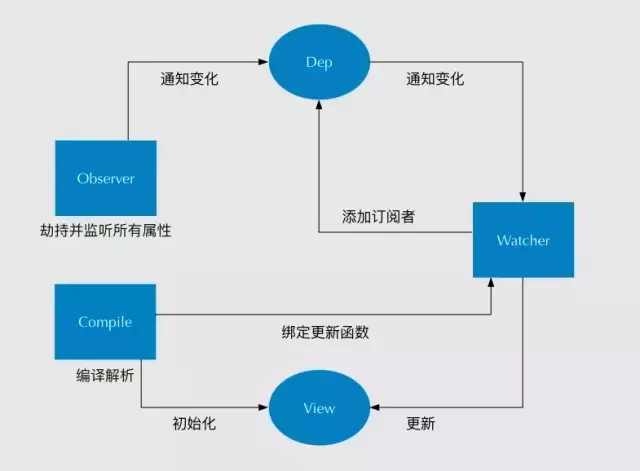

# HTML

## 1、块元素和行内元素区别是什么？常见块元素和行内元素有哪些？

块元素的特点：

- 独占一行，不能与其他元素并排显示。
- 可以设置宽度、高度、边框、内边距和外边距。
- 默认宽度为父元素的100%。
- 默认高度为子元素的总高度。

行内元素的特点是：

- 可以与其他行内元素或行内块元素并排显示，不会换行。
- 不能设置宽度、高度、上下边框和上下内边距。
- 默认宽度为内容的宽度。
- 默认高度为一行的高度。

行内块元素的特点是：

- 可以与其他行内元素或行内块元素在一行显示，但是之间会有空白缝隙。设置它上一级的`font-size`为0，才会消除缝隙。
- 可以设置宽度、高度、边框、内边距和外边距。
- 默认宽度为内容的宽度，不会自动填满父元素的宽度。
- 默认高度为内容的高度，不会自动撑开父元素的高度。

常见的块元素：`div p h1-h6 ul ol li`

常见的行内元素：`span a label`

常见的行内块元素：`button img input select textarea`


## 2、简述一下你对HTML语义化的理解？

HTML语义化：就是页面去掉样式或者加载失败的时候能够让页面呈现出清晰的结构。在写页面的时候，我们可以直接引用语义化标签，不需要再使用没有任何含义的`div`标签。语义化标签对于机器来说可以识别，对于开发人员来说很容易明白。


HTML5新增的语义化标签：`header nav aside main footer section article menu`


语义化的好处：

- 有利于SEO：语义化标签使搜索引擎更好的理解网页内容，提高网页在搜索结果中的排名。
- 方便其他设备解析（如屏幕阅读器、盲人阅读器、移动设备）以语义化的方式来渲染网页。
- 方便项目的开发及维护，使HTML代码更具有可读性。


## 3、HTML的字符实体是什么？

1. 介绍概念和作用
   - HTML字符实体是一种用来替换HTML中预留或者无法直接输入的字符的编码方式。
2. 说明HTML的字符实体的组成部分
   - 它由一个和号`&`和一个实体名称，以及一个分号`;`组成。
   - 或者是由一个和号`&`，一个井号`#`，一个实体编号，以及一个分号`;`组成。
   - 空格：`&nbsp;`或`&#160;`
   - 版权符号：`&copy;`或`&#169;`
3. 总结优缺点
   - HTML字符实体可以避免浏览器误解预留字符或者显示特殊符号，但是它也增加了代码的长度和复杂度。


## 4、回流和重绘？

回流和重绘是浏览器渲染页面时的两个过程，它们都会影响页面的性能和用户体验，所以我们应该尽量避免或者减少它们的发生。

回流是当页面中的元素发生了几何属性（如宽度、高度、位置等）的变化，导致浏览器需要重新计算元素的布局，更新渲染树，并重新绘制元素的过程。回流会影响到渲染树中的所有节点，所以它是一个比较耗费性能的过程。

重绘是当页面中的元素发生了视觉属性（如颜色、背景、边框等）的变化，但不影响布局时，浏览器只需要重新绘制元素，而不需要重新计算布局的过程。重绘只影响到渲染树中的部分节点，所以它比回流更轻量级。

回流和重绘的区别就是页面布局是否改变。回流一定会触发重绘，而重绘不一定会触发回流。

一些常见的导致回流和重绘的操作有：

- 改变元素的大小、位置、边距、内边距、边框等会导致回流。
- 改变元素的颜色、背景、字体等会导致重绘。
- 添加或者删除可见的DOM节点会导致回流。
- 激活CSS伪类（如`:hover`）会导致重绘或者回流。
- 获取一些布局信息（如offset系列，scroll系列，client系列）会导致强制回流。

为了优化页面的渲染性能，可以采用以下一些方法：

- 批量修改样式，比如使用class来一次性修改多个样式属性，而不是逐个修改。
- 使用`transform`、`opacity`、`filter`等属性来实现动画效果，而不是使用`left`、`top`、`width`等属性。
- 使用文档碎片或者离线DOM来批量操作节点，比如先将节点隐藏或者移出文档流，然后进行多次修改，最后再显示或者插入到文档流中。
- 避免使用`table`布局，因为表格中的一个单元格变化会导致整个表格的回流。
- 避免使用强制回流的属性或方法，比如`offsetWidth`、`offsetHeight`等，因为它们会让浏览器立即执行队列中的所有回流操作。


题外内容：

- 文档碎片
  - 文档碎片的使用方法如下：

    - 使用`document.createDocumentFragment()`方法创建一个空白的文档碎片对象。
    - 使用`appendChild()`方法将需要插入的DOM节点添加到文档碎片中。
    - 使用`appendChild()`方法将文档碎片插入到目标节点中。

  - 代码举例：

    ```javascript
    // 获取 ul 节点
    var ul = document.querySelector("ul");
    // 创建文档碎片
    var fragment = document.createDocumentFragment();
    // 循环创建 100 个 li 节点，并添加到文档碎片中
    for (var i = 0; i < 100; i++) {
      var li = document.createElement("li");
      li.textContent = i + 1;
      fragment.appendChild(li);
    }
    // 将文档碎片插入到 ul 节点中
    ul.appendChild(fragment);
    ```

  - 好处：

    - 这样只会触发一次回流和重绘，而不是每次插入一个节点就触发一次。

- 离线DOM

  - 可以通过设置元素属性`display:none`，将其从页面上去掉，然后进行后续操作，这些后续操作也不会触发回流和重绘，这个过程称为离线操作。

  - 代码举例：

    ```javascript
    let container = document.getElementById('container')
    container.style.display = 'none'
    container.style.width = '100px'
    container.style.height = '200px'
    container.style.border = '10px solid red'
    container.style.color = 'red'
    ...（省略了许多类似的后续操作）
    container.style.display = 'block'
    ```

    

## 5、浏览器解析渲染机制？

浏览器解析渲染机制是指浏览器如何将接收到的HTML、CSS、JavaScript等文件转换为用户可以看到和交互的网页的过程。大致可以分为以下几个步骤：

1. 构建DOM树。浏览器会自上而下地解析HTML文件，将标签、文本、注释等转换为DOM节点，并按照层级关系构建成一棵DOM树。
2. 构建CSSOM树。浏览器会解析CSS文件，将选择器、属性、值等转换为CSSOM节点，并按照层级关系构建成一棵CSSOM树。
3. 生成渲染树。浏览器会将DOM树和CSSOM树合并，生成一棵渲染树，渲染树上地每个节点都包含了元素地内容和样式信息。
4. 布局渲染树。浏览器会根据渲染树上地信息，计算出每个节点在视口中的位置和大小，这个过程叫做布局或者回流。
5. 绘制渲染树。浏览器会根据布局得到的结果，将渲染树上的每个节点绘制到屏幕上，这个过程叫做绘制或者重绘。

在这个过程中，如果HTML、CSS或者JavaScript文件发生了变化，可能会导致渲染树、布局或者绘制的更新，这些更新会影响页面的性能和用户体验，所以我们应该尽量减少不必要的更新，优化页面的解析渲染机制。


题外内容：


- 解析HTML，生成DOM树；解析CSS，生成CSSOM树。
- 将DOM树和CSSOM树结合，生成渲染树。
- Layout(回流)：根据生成的渲染树，进行回流，得到节点的几何信息。
- Painting(重绘)：根据渲染树以及回流得到的几何信息，得到节点的绝对像素。
- Display：将像素发送给GPU，展示在页面上。


# CSS

## 1、讲一下盒模型，普通盒模型和怪异盒模型有什么区别？

盒模型是指在网页设计中，每个元素都被视为一个拥有宽度、高度、边框、内边距和外边距的矩形盒子。盒模型分为两种：**标准盒模型**和**怪异盒模型**。


标准盒模型的元素宽度和高度由**内容区域、边框、内边距和外边距**四个部分组成。

标准盒宽度和高度计算公式：

- 总宽度 = 内容区域宽度 + 左右边框 + 左右内边距 + 左右外边距
- 总高度 = 内容区域高度 + 上下边框 + 上下内边距 + 上下外边距


怪异盒模型的元素宽度和高度由**内容区域，边框**两个部分组成。

怪异盒宽度和高度计算公式：

- 总宽度 = 内容区域宽度 + 左右边框
- 总高度 = 内容区域高度 + 上下边框


## 2、伪类和伪元素的区别是什么？

伪类是用来选择处于特定状态的元素，比如`:hover`，`:active`等。

伪元素是用来创造虚构的元素，比如`::before`，`::after`等。

伪类不会创造新的元素，而伪元素会。

伪类以单冒号(:)开头，而伪元素以双冒号(::)开头。


## 3、CSS如何实现居中布局？

水平居中：

- 行内元素居中：
  - 父元素设置`text-align:center;`
- 块级元素居中：
  - 指定宽度后，设置`margin:0 auto;`

垂直居中：

- 行内元素居中：
  - 设置`line-height`与`height`相等。

- 块级元素居中：

  - 使用`flex`布局
  - 在已知高度的情况下：
    - 第一种：使用CSS3的新属性`calc`，计算`top`：`top: calc(50% - 50px)`
      - 请注意calc属性计算时运算符前后有空格。
    - 第二种：使用`top` + `margin-top`实现
  - 在未知高度的情况下：
  - 使用`margin-top:50%` + `transform:translateY(-50%)`
  


## 4、CSS的选择器有哪些？

- ID选择器 `#hello`
- 类选择器 `.container`
- 标签选择器 `div`
- 后代选择器 `h1 p`
- 相邻后代选择器 `h1>p`
- 兄弟选择器 `li~a`
- 相邻兄弟选择器 `li+a`
- 属性选择器 `input[type="text"]`
- 伪类选择器 `a:hover`
- 伪元素选择器 `::before`
- 通配符选择器 `*`


## 5、CSS优先级如何计算？

CSS优先级计算是指多个CSS声明作用于同一个元素时，如何确定哪个声明的效果最终生效。

CSS优先级计算的基本原则是：

- 优先级由选择器的类型和数量决定，一般来说，内联样式 > ID选择器 > 类选择器 = 属性选择器 = 伪类选择器 > 标签选择器 = 伪元素选择器 > 通配符选择器。
- 优先级可以用四个数字（a,b,c,d）表示，其中a表示内联样式的个数，b表示ID选择器的个数，c表示类选择器、属性选择器和伪类选择器的个数之和，d表示标签选择器和伪元素选择器的个数之和。比较优先级时，按照a,b,c,d的顺序依次比较，大的则优先级高，相等则比较下一个。
- 如果两个声明的优先级相同，则后出现的声明会覆盖前面的声明。
- 如果一个声明中使用了 `!important` 标志，则该声明的优先级最高，除非另一个声明也使用了 `!important` 并且优先级更高或者出现在后面。
- 优先级只与选择器有关，与选择器在文档的位置或者样式表中的位置无关。

举例：

```html
<style>
  <!-- 权重：0101 -->
  <!-- 权重最高 -->
  #container p {
    color: red;
  }
  <!-- 权重：0010 -->
  .box {
    color: green;
  }
  <!-- 权重：0001 -->
  p {
    color: blue !important;
  }
</style>
<div id="container">
  <p class="box">Hello</p>
</div>
```


## 6、长度单位px，em和rem的区别是什么？

px时相对于屏幕分辨率的长度单位。px的有点是精确和一致，缺点是不灵活，不能自适应不同设备的屏幕尺寸和分辨率。

em是相对于当前元素的字体大小的长度单位，1em等于当前元素的`font-size`。如果当前元素没有设置`font-size`，则会继承父元素的`font-size`。em的优点是可以实现元素内部的缩放效果，缺点是计算复杂，容易受到父元素的影响。

rem是相对于根元素(html)的字体大小的长度单位，1rem等于html元素的`font-size`。如果html元素没有设置`font-size`，则会使用浏览器的默认字体大小(通常是16px)。rem的优点是可以实现整个页面的缩放效果，且计算简单，不受父元素的影响，缺点是兼容性不如px和em。


## 7、讲一下flex弹性盒布局？

1. 概念和优势
   - flex布局是一种用于按行或列布局元素的一维布局方法，它可以为盒状模型提供最大的灵活性，可以方便地实现各种对齐、分布、缩放等效果。
2. 核心属性
   - flex布局主要有以下几个属性：
     - `display`用于指定一个容器为flex布局
     - `flex-direction`用于指定主轴的方向
     - `justify-content`用于指定主轴的对齐方式
     - `align-items`用于指定交叉轴的对齐方式
     - `flex-wrap`用于指定是否换行
3. 总结flex布局的特点和优缺点
   - 总之，flex布局是一种非常灵活和强大的布局方法，它可以适应不同的屏幕尺寸和设备，也可以简化很多复杂的布局问题。但是，它也有一些缺点，比如兼容性问题，需要使用浏览器前缀或者polyfill来支持老旧的浏览器；还有性能问题，如果项目过多或者嵌套过深，可能会影响渲染速度和内存消耗。


## 8、浮动塌陷问题的解决方法是什么？

1. 介绍浮动塌陷的概念和原因
   - 浮动塌陷是指当一个容器的子元素浮动后，导致容器的高度丢失或者缩小，从而影响布局的现象。这是因为浮动元素脱离了文档流，不占据容器的空间，而容器的高度默认是由子元素撑开的。
2. 列举浮动塌陷的几种解决方法
   - 给容器设置固定的高度，这样就不依赖子元素的高度了。但这样做需要知道容器的精确高度，而且不利于响应式布局。
   - 给容器设置`overflow`属性为`hidden`或者`auto`，这样可以触发BFC(块级格式化上下文)，让容器包含浮动元素。但这样做可能会导致内容溢出或者出现滚动条。
   - 给容器添加一个空元素，并给它设置`clear`属性为`both`，这样就可以清除浮动，让容器恢复正常高度。但这样做需要增加额外的标签和样式。
   - 使用**伪元素**在容器的最后添加一个**内容为空**的**块级元素**，并给它设置`clean`属性为`both`，这样也可以清除浮动，而且不需要增加额外的标签和样式。


## 9、讲一下position的属性值的含义？

1. 介绍`position`属性的概念和作用
   - `postion`是CSS中用来控制元素定位方式的一个属性，它可以让元素按照文档流或者相对于其他元素进行偏移或者固定。
2. 列举`position`属性
   - `postion`由5个值，分别是`static`、`relative`、`absolute`、`fixed`和`sticky`，它们决定了元素是按照文档流还是脱离文档流进行定位，以及相对于哪个参考点进行偏移或者固定。
     - `static`是默认值，表示元素按照文档流进行定位，不受其他定位属性的影响。
     - `relative`表示元素按照文档流进行定位，然后相对于自身进行偏移，偏移不会影响其他元素的位置。
     - `absolute`表示元素脱离文档流，相对于最近的定位祖先元素或者初始包含块进行定位，元素的位置由其他定位属性确定。
     - `fixed`表示元素脱离文档流，相对于视口进行定位，元素的位置由其他定位属性确定，元素在页面滚动时不会改变位置。
     - `sticky`表示元素按照文档流进行定位，然后在其最近滚动祖先和其包含块之间切换相对定位和固定定位，实现“粘性”效果。


## 10、position:fixed一定是相对于浏览器窗口进行定位吗？

1. 介绍`position:fiexd`

   - `position:fiexd`通常是相对于浏览器窗口进行定位的，这意味着它不随滚动条滚动，而是始终保持在某个位置不动。

2. 说明`position:fiexd`属性的特殊规则

   - 但是，如果`position:fixed`元素的祖先元素具有某些CSS属性，那么`position:fixed`元素就不再相对于浏览器窗口进行定位，而是相对于祖先元素进行定位。这些属性包括`transform`、filter、perspective、contain、mix-blend-mode等。

3. 总结

   - 这些CSS属性会使祖先元素成为`position:fixed`元素的包含块，也就是`position:fixed`元素的定位参考点。这样`position:fixed`元素就会随着祖先元素的滚动而滚动，并且受到祖先元素的大小和位置的影响。

4. 示例代码

   ```html
   <html>
       <head>
           <style>
               * {
                   margin: 0;
                   padding: 0;
                   box-sizing: border-box;
               }
   
               .container {
                   height: 2000px;
               }
   
               #b1 {
                   height: 400px;
                   background-color: aqua;
               }
   
               #b2 {
                   height: 800px;
                   background-color: red;
                   /* 切换这个属性即可验证 */
                   transform: scale(1);
               }
   
               .ad {
                   position: fixed;
                   top: 50%;
                   transform: translateY(-50%);
                   width: 200px;
                   height: 300px;
                   background-color: #73ad21;
               }
           </style>
       </head>
       <body>
           <div class="container">
               <div id="b1"></div>
               <div id="b2">
                   <div class="ad"></div>
               </div>
           </div>
       </body>
   </html>
   ```


## 11、BFC和IFC？

BFC和IFC是CSS布局中的两种格式化上下文，它们是一种独立的渲染区域，有自己的布局规则，可以与其他格式化上下文相互隔离。

BFC是块级格式化上下文，它是由块级盒子组成的 ，比如`div p ul`等元素。BFC的布局规则如下：

- BFC中的元素按照垂直方向从上到下排列，相邻元素的外边距会发生重叠。
- BFC中的元素不会影响或者被影响到外部的元素，也就是说BFC是一个独立的容器。
- BFC的宽度由包含块的宽度和浮动元素决定，也就是说BFC可以包含浮动元素，并防止浮动元素溢出。
- BFC可以组织元素被父元素的边距折叠。

BFC可以通过以下方式触发：

- 根元素（整个页面就是一个大的BFC）
- float 为 left | right
- overflow 为 hidden | auto | scroll
- display 为 inline-block | table-cell | table-caption | flex | inline-flex
- position 为 absolute | fixed

BFC的功能：

- 解决margin塌陷
- 清除浮动
- 防止普通文档流被浮动元素遮挡

IFC是行内格式化上下文，它是由行内盒子组成的，比如`span a img`等元素，IFC的布局规则如下：

- IFC中的元素按照水平方向从左到右排列，相邻元素的外边距不会发生重叠。
- IFC中的元素会根据垂直对齐方式（vertical-align）进行对齐，可以是顶部对齐、底部对齐、居中对齐等。
- IFC中的元素不会影响或者被影响到外部的元素，也就是说IFC是一个独立的容器。
- ICC的高度由包含块的高度和行框决定，也就是说IFC可以包含多行文本，并根据行高进行换行。

IFC可以通过以下方式触发：

- display 为 inline | inline-block


题外内容：

[深度剖析Margin塌陷，BFC，Containing Block之间的关系](https://zhuanlan.zhihu.com/p/30168984)


# Vue

## 1、讲一下computed和watch的区别？

1. 介绍概念和作用
   - `computed`是计算属性，用来根据现有的属性计算出一个新的属性。
   - `watch`是监听，用来监听`data`中的数据变化，并执行相应的回调函数。
2. 列举核心区别
   - `computed`支持缓存，当其依赖的属性没有发生变化时，计算属性会从缓存中读取，而不会重新计算；`watch`不支持缓存，当监听的属性发生变化时，每次都会执行回调函数。
   - `computed`适用于根据其他属性的变化而变化的场景，比如购物车商品结算；`watch`适用于根据数据变化而执行异步操作或开销较大的操作的场景，比如搜索框根据关键词发送请求。
   - `computed`只能返回一个值，不能执行其他操作；`watch`可以返回任意值或执行任意操作。
   - `computed`默认只有`getter`方法，如果需要`setter`方法，需要手动设置；`watch`默认有`handler`方法，可以设置`deep`、`immediate`等选项。


## 2、v-if和v-show的区别？

1. 介绍概念和作用
   - `v-if`和`v-show`都是Vue中的指令，用来控制元素的显示和隐藏。
2. 列举核心区别
   - `v-if`是根据条件来动态地增加或删除DOM元素，只有当条件为真时才会渲染元素；`v-show`是根据条件来动态地显示或隐藏元素，无论条件是否为真，元素都会被渲染，只是通过CSS的`display`属性来控制显隐。
   - `v-if`有更高的切换开销，因为每次切换都会触发元素的销毁和重建；`v-show`有更高的初始渲染开销，因为无论条件是否为真，元素都会被渲染。
   - `v-if`支持`template`标签，可以在一个条件块中包含多个元素；`v-show`不支持`template`标签，只能作用于单个元素。
   - `v-if`搭配`v-else`可以实现多分支的条件渲染；`v-show`没有类似指令，只能实现单分支的条件渲染。


## 3、Vue常用指令？

Vue指令是指在Vue模板中使用的一些特殊的属性，以`v-`开头，用于实现一些动态的功能。Vue常用指令有以下几种：

- **v-bind**：用于动态地绑定一个或多个属性，或一个组件的`prop`，可以缩写为冒号(:)。
- **v-on**：用于在元素上监听事件，可以缩写为@。
- **v-model**：用于在表单控件或组件上创建双向数据绑定。
- **v-if**：用于根据表达式的真假值，来条件性地渲染元素或模板片段。
- **v-show**：用于根据表达式的真假值，来切换元素的显示和隐藏。
- **v-for**：用于基于原始数据多次渲染元素。
- **v-slot**：用于向组件传递内容，可以缩写为#。
- **v-pre**：用于跳过该元素和子元素的编译过程，直接显示原始的Mustache标签。
- **v-cloak**：用于在Vue实例结束编译之前一直保持在元素上，可以配合CSS规则`[v-cloak]{display:none}`来隐藏未编译的Mustache标签，避免闪烁现象。
- **v-once**：用于只渲染一次元素和组件，不会随着数据的改变而更新。


## 4、Vue父子组件挂载顺序？

Vue父子组件挂载顺序是指在Vue组件渲染和更新的过程中，父组件和子组件的`mounted`生命周期钩子函数的执行顺序。`mounted`生命周期钩子函数是在组件被挂载到DOM后调用的，通常用于执行一些依赖于DOM的操作。

Vue父子组件挂载顺序的一般规律是：父组件先创建，然后子组件创建；子组件先挂载，然后父组件挂载。也就是说，父组件的`mounted`生命周期钩子函数会在所有子组件的`mounted`生命周期钩子函数之后调用。这样可以保证父组件可以访问到完整的DOM结构，包括所有子组件的DOM元素。


题外内容：

```markdown
# 加载渲染过程
父 beforeCreate -> 父 created -> 父 beforeMount -> 子 beforeCreate -> 子 created -> 子 beforeMount -> 子 mounted -> 父 mounted

# 更新过程
父 beforeUpdate -> 子 beforeUpdate -> 子 updated -> 父 updated

# 销毁过程
父 beforeDestroy -> 子 beforeDestroy -> 子 destroyed -> 父 destroyed
```


## 5、v-model的作用？

`v-model`的作用是在表单元素和数据之间建立双向绑定，让数据的变化能够实时反映在视图上，也让用户的输入能够自动更新到数据中。

`v-model`的实现原理是通过`v-bind`绑定一个value属性，用来接收数据，并通过`v-on`绑定一个input事件，用来监听用户输入并更新数据。例如：

```
<input type="text" v-model="msg">
相当于
<input type="text" :value="msg"@input="msg=$event.target.value">
```

`v-model`还可以根据不同的表单元素类型，使用不同的属性和事件，比如`radio、checkbox、select`等，并且支持一些修饰符，比如`.lazy、.number、.trim`等，来实现更灵活的双向绑定。


## 6、v-for和v-if放在一起用好吗？

`v-for` 和 `v-if` 放在一起用不好。

在Vue2中，`v-for` 比 `v-if` 优先级高，这意味着如果同时使用 `v-for` 和 `v-if`，`v-if` 会在每个 `v-for` 循环中执行，可能会导致性能损失。如果目的是有条件地跳过循环的执行，那么可以将 `v-if` 放置于外层元素（或<template>）上。如：

```vue
<ul v-if="todos.length">
  <li v-for="todo in todos">
    {{ todo }}
  </li>
</ul>
<p v-else>No todos left!</p>
```

在Vue3中，`v-if` 比 `v-for` 的优先级更高，这意味着 `v-if` 的条件将无法访问到 `v-for` 作用域内定义的变量别名。这种情况可以在外层新包装一层 `<template>` 再在其上使用 `v-for` 就可以解决这个问题。如：

```vue
<template v-for="todo in todos">
  <li v-if="!todo.isComplete">
    {{ todo.name }}
  </li>
</template>
```

除了嵌套元素这种解决方法外，Vue官方也推荐使用计算属性来解决以上问题。使用计算属性来过滤出需要显示的列表项，然后在模板中只使用 `v-for`。


题外内容：

[Vue2的官方解释](https://v2.cn.vuejs.org/v2/guide/list.html#v-for-object)

[Vue3的官方解释](https://cn.vuejs.org/guide/essentials/list.html#v-for-with-v-if)


## 7、Vue组件样式污染？

Vue组件样式污染是指一个组件的样式影响到了另一个组件的样式，导致页面显示不正确或不一致的问题。这个问题通常发生在使用全局样式或者相同的类名时。

最常用的是使用 `scoped` 属性。`scoped` 属性可以让组件的样式只作用于当前组件，而不会影响其他组件。这是通过给每个组件添加一个唯一的属性，然后在样式中使用属性选择器来实现的。


## 8、Vue如何给一个对象添加新的属性？

这个问题涉及到Vue的数据响应式原理。Vue的数据响应式原理是基于 `Object.defineProperty()` 方法，它可以把对象的属性转换为 `getter` 和 `setter`，从而实现对数据的监听和更新。但是，这个方法有一个限制，就是它不能检测到对象属性的添加和删除。也就是说，如果在这个实例创建之后给对象添加新的属性，这个属性不会被Vue转换为响应式的，也不会触发视图更新。

为了解决这个问题，Vue提供了两种方法来给对象添加新的响应式属性：

1. `Vue.set(object,key,value)` 或 `vm.$set(object.key,value)`：这两个方法是等价的，它们个可以在对象上添加一个新的属性，并且让这个属性变成响应式的，同时触发视图更新。这个方法适合给对象添加少量的新属性。
2. `Object.assign(target,source)`：这个方法可以创建一个新的对象，并且把源对象和新添加的属性合并到一起。这样，新对象就会拥有源对象的所有响应式属性和新添加的属性。然后，把新对象赋值给原来的变量，就可以实现视图更新。这个方法适合给对象添加多个新属性。


## 9、Vue的keep-alive组件？什么时候会用到？

`keep-alive` 是Vue的一个内置组件，它的功能是在多个组件间动态切换时缓存被移除的组件实例，从而避免重复渲染和销毁组件，提供性能和用户体验。

`keep-alive` 组件有两个常用的prop属性：`include` 和 `exclude`，它们可以用来定制哪些组件需要被缓存，哪些不需要。这两个属性的值可以是一个字符串、一个正则表达式或者一个数组，它们会根据组件的 `name` 选项进行匹配。

`keep-alive` 组件还有一个 `max` 属性，可以用来限制可被缓存的最大组件实例数。当缓存的实例数量超过指定的最大书香时，最久没有被访问的缓存实例将被销毁，以便为新的实例腾出空间。

当一个组件被 `keep-alive` 缓存时，它的生命周期会发生变化。它不会被卸载，而是变成不活跃状态。当它再次被激活时，它会重新渲染。为了处理这个情况，Vue提供了两个特殊的生命周期钩子函数：`activated` 和 `deactivated`。它们分别在组件被激活和被停用时调用。我们可以在这两个钩子中执行一些逻辑，比如获取数据、清除定时器等。

那么什么时候会用到 `keep-alive` 组件呢？一般来说，当我们需要在多个组件间频繁切换，并且希望保留组件的状态或避免重新请求数据时，就可以使用 `keep-alive` 组件。比如，在一个列表页和详情页之间切换，我们可能希望列表页能够保留滚动位置、筛选条件等状态，并且不需要每次都重新加载数据，就可以使用 `keep-alive` 组件，可以提高性能和用户体验。


## 10、process.nextTick和Vue.nextTick的区别？

`process.nextTick` 是Node.js中的一个方法，它可以在当前执行栈的尾部（同步代码执行完毕）添加一个回调函数，让它在下一个事件循环的开始（异步代码执行之前）执行。它相当于把一个任务放到了微任务队列中，优先于其他异步任务执行。

`Vue.nextTick` 是Vue中的一个方法，它可以在下次DOM更新循环结束之后执行一个延迟回调。它相当于把一个任务放到了宏任务队列中，等待当前的微任务队列和DOM更新完成后执行。

它们的区别主要有以下几点：

- 它们属于不同的运行环境，`process.nextTick` 是Node.js中的方法，而 `Vue.nextTick` 是Vue中的方法。在浏览器中，没有 `process` 对象，也就没有 `process.nextTick` 方法。
- 它们执行的时机不同，`process.nextTick` 会在当前执行栈的尾部执行，而 `Vue.nextTick` 会在下次DOM更新循环结束后执行。这意味着 `process.nextTick` 会比 `Vue.nextTick` 更早执行。
- 它们使用的场景不同，`process.nextTick` 一般用于处理异步流程中的同步任务，比如 `Promise` 的 `then ` 方法或 `async/await` 语法。`Vue.nextTick` 一般用于处理数据变化后DOM还未及时更新的问题，比如获取数据更新后最新DOM的变化或避免重复操作DOM。


## 11、watch中deep和immediate的作用？

deep：表示是否深度监听，如果为true，那么可以监听对象或数组中每个属性的变化，而不仅仅是对象或数组本身的变化。这样就可以实现对复杂数据类型的检测，但是性能开销会比较大。

immediate：表示是否立即执行监听函数，如果为true，那么在watch绑定时就会执行一次监听函数，而不用等到数据变化时才执行。这样可以实现对初始数据的处理，但是可能会导致多余的执行。


## 12、Vue的slot？有什么作用？

slot是Vue中的一种内容分发的机制，可以让父组件在子组件的模板中插入内容。

slot有以下几种作用：

- slot可以让组件更加灵活和可复用，可以实现内容和样式的分离。
- slot可以让父组件根据不同的场景传入不同的内容，而不需要修改子组件的模板。
- slot可以让子组件提供多个插槽出口，让父组件可以在不同的位置插入内容。
- slot可以让子组件向父组件传递一些属性，也就是插槽prop，让父组件可以在插槽中访问子组件的数据。


## 13、vue如何实现自定义指令？

Vue可以通过两种方式实现自定义指令：全局指令和局部指令。

Vue2中通过 `Vue.directive()` 函数注册一个全局指令；局部指令是通过组件的 `directives` 属性，只能在该组件中使用。

Vue3中通过应用实例 `app.directive()` 函数注册一个全局指令；局部指令的创建有两种情况：

- 在 `<script setup>` 语法中，任何以 `v` 开头的**驼峰式命名**的变量都可以被用作一个自定义指令。
- 在没有使用 `script setup` 语法的情况下，自定义指令需要通过 `directives` 选项注册。

一个指令的定义对象可以提供几种钩子函数，都是可选的：

```javascript
const myDirective = {
  // 在绑定元素的 attribute 前
  // 或事件监听器应用前调用
  created(el, binding, vnode, prevVnode) {},
  // 在元素被插入到 DOM 前调用
  beforeMount(el, binding, vnode, prevVnode) {},
  // 在绑定元素的父组件
  // 及他自己的所有子节点都挂载完成后调用
  mounted(el, binding, vnode, prevVnode) {},
  // 绑定元素的父组件更新前调用
  beforeUpdate(el, binding, vnode, prevVnode) {},
  // 在绑定元素的父组件
  // 及他自己的所有子节点都更新后调用
  updated(el, binding, vnode, prevVnode) {},
  // 绑定元素的父组件卸载前调用
  beforeUnmount(el, binding, vnode, prevVnode) {},
  // 绑定元素的父组件卸载后调用
  unmounted(el, binding, vnode, prevVnode) {}
}
```

钩子参数：

`el`：指令绑定道的元素。这可以用于直接操作DOM。

`binding`：一个对象，包含传递给指令的值，参数等。

`vnode`：代表绑定元素的底层VNode。

`prevNode`：之前的渲染中代表指令所绑定元素的VNode。仅在 `beforeUpdate` 和 `updated` 钩子中可用。


当在组件上使用自定义指令时，它会始终应用到组件的根节点。如果组件有多个根节点，那么指令将会被忽略并抛出一个警告。


官方贴士：

1. 只有当所需功能只能通过直接的 DOM 操作来实现时，才应该使用自定义指令。其他情况下应该尽可能地使用 `v-bind` 这样的内置指令来声明式地使用模板，这样更高效，也对服务端渲染更友好。
2. 不推荐在组件上使用自定义指令。


题外内容：

[Vue2官方链接：自定义指令](https://v2.cn.vuejs.org/v2/guide/custom-directive.html)

[Vue3官方链接：自定义指令](https://cn.vuejs.org/guide/reusability/custom-directives.html#introduction)


## 14、use方法的使用？

`use()` 方法的作用是安装一个插件。插件是一种能为Vue添加全局功能的工具代码。

`use()` 方法可以传递两个参数，第一个参数是插件本身，可选的第二个参数是要传递给插件的配置选项。

插件可以是一个带 `install()` 方法的对象；或者是一个将被用作 `install()` 方法的函数。插件选项将会传递给插件的 `install()` 方法。

如果 `use()` 方法对同一个插件多次调用，该插件只会被安装一次。


题外内容：

[Vue3官方链接：app.use()](https://cn.vuejs.org/api/application.html#app-use)

[Vue3官方链接：插件](https://cn.vuejs.org/guide/reusability/plugins.html)


## 15、Vue和React的区别是什么？(待完善)

1. 响应式原理不同
2. 监听数据变化的实现原理不同
3. 组件写法不同
4. Diff算法不同
5. 核心思想不同
6. 数据流不同
7. 组合不同功能的方式不同（mixin和HoC)
8. 组件通信方法不同
9. 模板渲染方式不同
10. 渲染过程不同
11. 框架本质不同


题外内容：

[Vue和React的区别到底是什么？ - 掘金 (juejin.cn)](https://juejin.cn/post/7071889478305972255#heading-13)

[浅谈React 虚拟DOM，Diff算法与Key机制 - 掘金 (juejin.cn)](https://juejin.cn/post/6967626390380216334#heading-1)


## 16、Vue父子组件如何通信？兄弟组件如何通信？

父子组件通信：

- 父组件通过 `props` 向子组件传递数据，子组件通过 `$emit` 触发事件向父组件传递数据。这是最基本的通信方式，也是单向数据流的体现。`props` 是单向绑定的，不能在子组件中修改，否则会报错。`$emit` 可以携带参数，也可以自定义事件名。
- 父组件通过 `$refs` 访问子组件的属性和方法，子组件通过 `$parent` 或 `$root` 访问父组件或根组件的属性和方法。这是一种直接操作组件实例的方式，不推荐过度使用，因为会破会组件的封装性和复用性。
- 父组件通过 `provide` 提供数据或方法，子组件通过 `inject` 接收数据或方法。这是一种跨级通信的方式，可以避免多层嵌套 `props` 传递。`provide` 和 `inject` 不受层级限制，只要在祖先组件中提供了数据或方法，后代组件都可以注入使用。

兄弟组件通信：

- 通过共同的父组件作为中介，父组件监听一个子组件的事件，并修改另一个子组件的 `props` 。这是一种简单的方式，但是如果兄弟组件较多或者层级较深，就会比较麻烦。
- 通过事件总线（Event Bus）进行通信。事件总线是一个Vue实例，用来在任意两个组件之间传递事件和数据。可以在全局或者局部注册事件总线，并在需要通信的组件中使用 `$on` 监听事件和 `$emit` 触发事件。
- 通过Vuex进行通信。Vuex是一个专为Vue应用开发的状态管理模式，它提供了一个全局的store来存储应用的状态，并通过一些规则保证状态的可预测性。任何组件都可以从store中获取状态，并通过提交 `mutation` 或者派发 `action` 来改变状态。


题外内容：

[Vue3官方链接： 依赖注入](https://cn.vuejs.org/guide/components/provide-inject.html)


## 17、Vue的Event Bus

**Vue中Event Bus的原理？**

Event Bus的原理是利用一个全局的事件总线，也就是一个中央事件管理器，让组件之间通过事件来通信，通过 `$emit()` 方法触发事件，再通过 `$on()` 方法监听该事件，从而实现组件间的状态共享。

**Vue中Event Bus是什么模式？发布者订阅者分别是做什么的？**

Event Bus基于发布订阅模式。发布订阅模式是一种广泛应用于组件间通信的模式，它基于一个中央事件管理器，即发布者。发布者负责发布事件，而订阅者则订阅并接收事件，从而实现组件间通信。

在Vue中，发布者就是通过 `$emit()` 方法触发事件的组件，而订阅者则通过 `$on()` 方法监听该事件。

**Vue中怎么实现Event Bus？**

只需要创建一个全局的Vue实例作为消息中心，并在需要的组件中使用 `$emit $on $off` 方法就好了。


## 18、Vue、React和JQuery在不同场景下怎么选型？

Vue、React和JQuery是三种不同的前端开发框架，它们各有优缺点，适用于不同的场景。

- JQuery是一个轻量级的JavaScript库，它可以兼容各种浏览器，提供了丰富的插件和动画效果。但是JQuery的体积较大，不适合流量限制较大的项目，也不适合移动端项目。而且JQuery是直接操作原生DOM，性能上也较差。因此，JQuery比较适合用来搭建没有什么交互行为的项目。
- Vue和React都是基于MVVM模式的前端框架，它们使用了虚拟DOM技术，避免了页面多次回流重绘的问题。它们也都实现了组件化，提高了代码的复用性和可维护性。它们都有自己的构建工具和调试工具，方便开发者快速搭建和调试项目。
- React和Vue的主要区别在于模板语法和数据流管理。React使用JSX语法，在JavaScript中嵌入HTML代码，这样可以让开发者更灵活地控制UI逻辑。Vue使用静态模板语法，将DOM和状态绑定在一起，这样可以让开发者更直观地看到UI结构。

React和Vue都是非常优秀的前端框架，它们之间没有绝对的优劣之分。具体使用什么框架取决于开发团队的熟练程度和项目需求。


## 19、Vue和JQuery的区别是什么？为什么JQuery被淘汰了？

**Vue和JQuery的区别是什么？**

- Vue和JQuery的主要区别在于它们的开发思路和范式。Vue是一种声明式编程语言，它通过数据驱动视图的方式来实现界面更新，不需要直接操作DOM元素。JQuery是一种命令式编程语言，它通过选择器获取DOM元素，并对其进行修改或添加事件监听来实现界面更新。
- Vue和JQuery的另一个区别在于它们的性能和优化方式。Vue使用虚拟DOM来提高渲染性能，它可以对静态的虚拟DOM节点进行优化，在数据变化时只更新相关的组件，避免不必要的渲染和diff操作。Vue提供了一些优化手段，比如computed，watch，异步组件等。JQuery也提供了一些优化手段，比如缓存选择器，使用事件委托，减少回流重绘等。

**为什么JQuery被淘汰了？**

- JQuery出现的目的是为了解决浏览器兼容性问题和简化DOM操作。但是随着HTML5规范的普及和浏览器厂商的同意遵循，浏览器兼容性问题已经不再是一个大问题。而且原生的JavaScript也提供了很多方便的API来操作DOM元素，比如 `querySelector addEventListener classList` 等。
- JQuery的设计理念已经过时，它不能适应现代的前端开发和趋势。随着单页应用的兴起和流行，前端开发需要更多的功能和特性，比如双向绑定，组件化，路由管理，状态管理等。JQuery作为一个DOM操作库，不能提供这些功能和特性，而需要依赖其他的框架或库来实现。而Vue作为一个前端框架，可以提供这些功能和特性，而且可以和其他插件和库很好地集成，形成一个完整的前端解决方案。
- 随着ES6 / ES7 / ES8 等新的JavaScript标准的出现和实现，前端开发可以使用更多的语法糖和新特性，比如箭头函数，模板字符串，解构赋值，Promise，async / await等。JQuery作为一个基于ES5的库，不能充分利用这些新特性。而Vue作为一个基于ES6+的框架，可以充分利用这些新特性。


## 20、computed和method的区别？

`computed` 和 `method` 是Vue中两种不同的定义函数的方式，它们有以下区别：

- **调用方式不同。**`computed` 定义的函数是以属性的形式访问的，不需要加括号，比如 {{ getFullName }}。`method` 定义的函数则需要加括号来调用，比如 {{ getFullName () }}。
- **缓存机制不同。**`computed` 定义的函数会根据它所依赖的数据进行缓存，只有当依赖的数据发生变化时，才会重新计算。`method` 定义的函数则没有缓存机制，每次调用都会重新执行。
- **适用场景不同。**`computed` 适用于根据一些数据计算出另一些数据的场景，比如根据姓名计算出全名，根据商品数量和单价计算出总价等。`method` 适用于执行一些具体的操作或逻辑的场景，比如发送请求，改变状态，触发事件等。


## 21、Vue的生命周期

**什么是生命周期钩子函数？**

Vue生命周期钩子是一些特殊的函数，它们会在组件的不同阶段被自动调用，让我们可以在合适的时机执行一些自定义的逻辑。

Vue生命周期钩子大致可以分为以下几类：

- 创建阶段：这个阶段是组件实例被创建和初始化的过程，涉及到 `beforeCreate` 和 `created` 两个钩子。
- 挂载阶段：这个阶段是组件实例被挂载到DOM上并开始渲染的过程，涉及到 `beforeMount` 和 `mounted` 两个钩子。
- 更新阶段：这个阶段是组件实例根据响应式的变化而重新渲染的过程，涉及到 `beforeUpdate` 和 `updated` 两个钩子。
- 卸载阶段：这个阶段是组件实例被销毁和移除的过程，涉及到 `beforeDestory` 和 `destoryed` 两个钩子。

使用生命周期钩子的好处是可以让我们在模板中直接操作DOM元素或组件实例，而不需要通过其他方式来获取它们。这有助于我们实现一些特殊的功能，比如程序化地聚焦输入框，或者初始化一个第三方库在一个元素上。

**有哪些常用的生命周期钩子函数？一般会做哪些操作？**

- **created**：在组件实例被创建之后调用，此时组件的 `data、methods、computed、watch` 等选项已经被初始化，但是还没有挂载到DOM上，也没有开始编译模板。这个钩子一般用于执行一些响应式的初始化逻辑，比如获取数据、设置定时器等。
- **mounted**：在组件实例被挂载到DOM之后调用。此时组件已经完成了渲染，并且可以访问到真实的DOM元素。这个钩子一般用于执行一些与DOM相关的渲染后逻辑，比如操作DOM元素、初始化第三方库等。
- **beforeUpdate**：在组件实例根据新数据重新渲染之前调用，此时组件还没有开始更新虚拟DOM和真实DOM。这个钩子一般用于执行一些更新前的逻辑，比如重置数据或状态等。
- **updated**：在组件实例根据新数据重新渲染之后调用。此时组件已经完成了更新虚拟DOM和真实DOM。这个钩子一般用于执行一些更新后的逻辑，比如操作更新后的DOM元素，同步非响应式数据等。
- **beforeDestory**：在组件实例被卸载之前调用。此时组件还没有开始移除虚拟DOM和真实DOM。这个钩子一般用于执行一些卸载前的逻辑，比如移除事件监听器或定时器等。
- **destoryed**：在组件实例被卸载之后调用。此时组件已经完成了移除虚拟DOM和真实DOM，并且失去了响应式能力。这个钩子一般用于执行一些卸载后的逻辑，比如释放资源或内存等。

**Vue3新增加了哪些生命周期钩子函数？**

| Vue2          | Vue3              | 说明                                 |
| :------------ | :---------------- | :----------------------------------- |
| beforeCreate  | -                 | 在组件实例被创建之前调用             |
| created       | -                 | 在组件实例被创建之后调用             |
| beforeMount   | onBeforeMount     | 在组件实例被挂载到DOM之前调用        |
| mounted       | onMounted         | 在组件实例被挂载到DOM之后调用        |
| beforeUpdate  | onBeforeUpdate    | 在组件实例根据新数据重新渲染之前调用 |
| updated       | onUpdated         | 在组件实例根据新数据重新渲染之后调用 |
| beforeDestroy | onBeforeUnmount   | 在组件实例被卸载之前调用             |
| destroyed     | onUnmounted       | 在组件实例被卸载之后调用             |
| activated     | onActivated       | 在keep-alive组件被激活时调用         |
| deactivated   | onDeactivated     | 在keep-alive组件被停用时调用         |
| errorCaptured | onErrorCaptured   | 在捕获到一个来自子孙组件的错误时调用 |
| -             | onRenderTracked   | 在渲染函数被追踪时调用               |
| -             | onRenderTriggered | 在渲染函数被触发时调用               |

**Vue父子组件的生命周期钩子函数的先后顺序？**

- **创建阶段：先父后子。**父组件的 `beforeCreate` 和 `created` 钩子先于子组件的 `beforeCreate` 和 `created` 钩子执行。
- **挂载阶段：先子后父。**子组件的 `beforeMount` 和 `mounted` 钩子先于父组件的  `beforeMount` 和 `mounted` 钩子执行。
- **更新阶段：先父后子。**父组件的 `beforeUpdate` 和 `updated` 钩子先于子组件的beforeUpdate和updated钩子执行。
- **卸载阶段：先子后父。**子组件的 `beforeDestory` 和 `destoryed` 钩子先于父组件的 `beforeDestory` 和 `destoryed` 钩子执行。

**为什么每个阶段的先后顺序不同？**

- 创建阶段：先父后子，是因为父组件需要先初始化自己的状态和选项，然后才能创建子组件的实例，并将自己的状态和选项传递给子组件。
- 挂载阶段：先子后父，是因为父组件需要先将子组件的模板编译成虚拟DOM，然后才能将自己的模板编译成虚拟DOM，并将子组件的虚拟DOM插入到自己的虚拟DOM中。最后，再将整个虚拟DOM渲染到真实DOM上。
- 更新阶段：先父后子，是因为父组件需要先根据新数据更新自己的虚拟DOM，然后才能更新子组件的虚拟DOM，并将新的子组件的虚拟DOM替换到自己的虚拟DOM中。最后，再将整个虚拟DOM和旧的虚拟DOM进行对比，找出差异，并更新到真实DOM上。
- 卸载阶段：先子后父，是因为父组件需要先将子组件的虚拟DOM从自己的虚拟DOM中移除，然后才能移除自己的虚拟DOM。最后，再将整个虚拟DOM从真实DOM上移除，并销毁组件实例。


## 22、Vue组件中data为什么是函数?

主要是为了解决组件复用时的数据隔离问题。

因为在Vue中，组件时可以被多次创建和销毁的，如果组件的data是一个对象，那么所有的组件实例就会共享同一个data对象，这样就会导致数据的污染和混乱。

为了避免这个问题，Vue要求组件的data必须是一个函数，这样每个组件实例就会有自己独立的data对象，互不影响。这也符合了组件化开发的原则，让每个组件都有自己的状态和逻辑，提高了代码的可维护性和可复用性。


## 23、Vue组件中data可以用箭头函数吗？

**可以用，但是不建议用。**

原因是，箭头函数的this指向的是定义时的上下文，而不是调用时的上下文。在Vue组件中，data必须是一个函数，而且这个函数必须返回一个对象，这样才能保证每个组件实例都有自己独立的数据。如果使用箭头函数，那么this就不会指向组件实例，而是指向**全局对象**或者**undefined**，导致无法访问组件的其他属性或方法。

如果一定要使用箭头函数，那么你可以通过第一个参数来访问组件实例。

```typescript
export default {
  data: (vm) => ({
    message: vm.myProp
  })
}
```


## 24、Vue的响应式原理？

Vue的响应式原理是指Vue能够自动检测数据的变化，并更新视图。Vue的响应式原理主要分为两个版本，Vue2和Vue3。

在Vue2中，响应式原理是通过使用ES5的 `Object.defineProperty()` 方法来实现的。`Object.defineProperty()` 可以让我们对对象的属性进行 `getter` 和 `setter` 的转化，从而在属性被访问和修改时通知变更。Vue会在初始化实例时对data对象上的所有属性执行 `getter` 和 `setter` 的转化，并创建一个 `watcher` 实例来收集依赖和触发更新。

在Vue3中，响应式原理是通过使用ES6的 `Proxy` 对象来实现的。`Proxy` 可以让我们拦截对象的所有操作，包括属性的访问、修改、删除、枚举等，并在操作发生时执行自定义的逻辑。Vue会在创建组件时为data对象创建一个响应式代理对象，并使用effect函数来收集依赖和触发更新。


## 25、Vue的编译过程？

1. 将模板字符串转换为AST（抽象语法树），这是一个用对象表示HTML结构和指令的树形结构。Vue使用了一些正则表达式来匹配和解析标签、属性、文本等元素，并创建相应的AST节点。
2. 将AST转换为render函数，这是一个用JavaScript代码表示虚拟DOM（VDOM）的函数。Vue使用了一些辅助函数来生成VDOM节点，并处理指令、插值表达式、事件绑定等逻辑。
3. 调用render函数，得到VDOM，这是一个用JavaScript对象表示真实DOM的轻量级结构。VDOM可以高效地比较和更新DOM，提高渲染性能。

编译的过程可以在运行时或者打包时进行。运行时编译是指在浏览器中动态地将模板编译为render函数，这需要引入编译器模块，增加了文件体积。打包时编译是指在构建工具中预先将模板编译成render函数，这样可以减少文件体积和运行时开销。


## 26、computed和watch的实现原理？

`computed` 和 `watch` 的实现原理都是基于 `Watcher类` 的，`Watcher类` 是Vue中用来管理依赖收集和派发更新的核心类。每个 `computed` 属性都会生成一个对应的 `Watcher` 实例，称为 `computed-watcher`。每个 `watch` 属性也会生成一个对应的 `Watcher` 实例，称为 `user-watcher`。除此之外，还有一个 `render-watcher`，用来监听组件渲染时用到的数据，并在数据变化时重新渲染组件。

`computed-watcher` 和 `user-watcher` 都有一个value属性和get方法。value属性存储着计算或侦听的值，get方法用来执行计算或侦听的函数，并返回赋值给value。不同的是，`computed-watcher` 还有一个 `lazy` 属性和一个 `dirty`属性。`lazy` 属性表示该watcher是否需要延迟求值，`dirty` 属性表示该watcher是否需要重新求值。`computed-watcher` 在初始化时会将 `lazy` 设置为true，`dirty` 设为true，表示不立即求值，而是等到视图渲染时才求值。

当视图渲染时，`render-watcher` 会遍历组件中用到的所有数据，并将自己添加到这些数据的订阅者列表中。如果遇到 `computed` 属性，就会调用其get方法，并触发其内部依赖数据的get方法。这样，`computed-watcher` 就会将自己添加到其依赖数据的订阅者列表中，并将 `dirty` 设为false，表示已经求过值了。同时，`render-watcher` 也会将自己添加到 `computed-watcher` 的订阅者列表中，表示视图依赖于该 `computed` 属性。


## 27、computed是怎么收集依赖的？

`computed` 的依赖收集是基于Vue的响应式系统的，它涉及到三个核心类：Dep、Watcher和Observer 。

Dep类是用来管理订阅者（Watcher）的，每个响应式数据都会有一个Dep实例，它有一个 subs数组，用来存储所有订阅了该数据的Watcher 。Dep类还有一个静态属性target，用来指向当前正在求值的Watcher。

Watcher类是用来封装观察者函数的，每个 `computed` 属性都会对应一个Watcher实例，称为computed-watcher。Watcher类有一个value属性，用来存储计算或侦听的值，还有一个get方法，用来执行计算或侦听的函数，并返回赋值给value。Watcher类还有一个update方法，用来通知自己的订阅者更新。

Observer类是用来实现数据响应式化的，它会遍历对象的每个属性，并使用`Object.defineProperty` 方法将其转换为getter/setter 。在getter中，会调用`Dep.target.addDep` 方法，将当前的Watcher添加到该数据的订阅者列表中 。在setter中，会调用 `dep.notify` 方法，通知所有订阅者更新。

`computed` 的依赖收集主要发生在两个时机：**初始化时和数据变化时**。

初始化时，computed-watcher会将自己的 `lazy` 属性设为true，表示需要延迟求值，并将 `dirty` 属性设为true，表示需要重新求值。当视图渲染时，render-watcher会遍历组件中用到的所有数据，并将自己添加到这些数据的订阅者列表中。如果遇到 `computed` 属性，就会调用其get方法，并触发其内部依赖数据的get方法。这样，computed-watcher就会将自己添加到其依赖数据的订阅者列表中，并将 `dirty` 设为false，表示已经求过值了。同时，render-watcher也会将自己添加到computed-watcher的订阅者列表中，表示视图依赖于该 `computed` 属性。

数据变化时，如果 `computed` 属性依赖的数据发生变化，就会通知所有订阅者更新。这时，computed-watcher会将 `dirty` 设为true，表示需要重新求值，并通知自己的订阅者更新。这样，render-watcher就会重新渲染视图，并再次调用 `computed` 属性的get方法，在这个过程中重新计算并缓存 `computed` 属性的值。


## 28、Vue数据双向绑定原理？

数据双向绑定是指数据和视图之间的双向关联，当数据发生变化时，视图会自动更新，当视图发生变化时，数据也会自动更新。这样可以减少手动操作DOM的次数，提高开发效率和用户体验。

Vue的数据双向绑定原理是通过数据劫持结合发布者-订阅者模式的方式来实现的。具体来说，就是通过 `Object.defineProperty()` 方法对每个属性设置getter和setter，从而实现对数据的监听和拦截。当访问属性时，会触发getter，将当前的订阅者（Watcher）添加到订阅器（Dep）中；当修改属性时，会触发setter，通知订阅器（Dep）调用所有订阅者（Watcher）的更新函数，从而更新视图。同时，Vue还利用了指令解析器（Compile）来扫描和解析每个节点的相关指令（如v-model，v-on等），并初始化相应的订阅者（Watcher）。

依赖收集的过程是在初始化时，通过 `Object.defineProperty()` 方法对每个属性设置getter和setter，当访问属性时，会触发getter，将当前的订阅者（Watcher）添加到订阅器（Dep）中。例如，当我们在模板中使用{{name}}时，就会创建一个Watcher对象，并将其添加到name属性对应的Dep对象中。这样就建立了name属性和Watcher对象之间的依赖关系。

Vue2数据绑定的缺点是需要递归遍历所有属性，消耗性能，而且无法检测到数组和对象的变化。例如，当我们修改数组的长度或者给对象添加新的属性时，并不会触发setter，因此视图也不会更新。

Vue3是通过Proxy对象来实现数据劫持，可以拦截对象的任意操作，不需要遍历所有属性，而且可以检测到数组和对象的变化。例如，当我们使用 `push` 方法修改数组或者使用 `Reflect.set` 方法给对象添加新的属性时，都会触发Proxy对象的set方法，并通知订阅器（Dep）调用所有订阅者（Watcher）的更新函数，从而更新视图。


## 29、给数组添加元素，Vue是怎么检测到数据变化的？

**回答步骤：**

1. 首先介绍Vue无法检测到数组的哪些变化，以及原因是什么。
2. 然后介绍Vue2是如何检测数组的变化的，即通过重写数组的常用方法，实现对数组操作的拦截和通知。
3. 接着介绍Vue3是如何检测数组的变化的，即通过Proxy对象来拦截数组的任意操作，实现对数组变化的监听和通知。
4. 最后介绍两种方法的优缺点，以及自己的看法或经验。

**回答：**

由于 `Object.defineProperty()` 的限制，Vue无法检测到以下数组变动：当你使用索引直接设置一项时，例如 `vm.items[indexOfItem] = newValue`；当你修改数组长度时，例如 `vm.items.length = newLength`。原因是这些操作并不会触发数组属性的setter方法，因此Vue无法感知到数据的变化。

Vue2是通过重写数组的常用方法，如 `push，pop，shift，unshift，splice，sort，reverse` 等，来实现对数组操作的拦截和通知。具体来说，就是让data中的数组继承一个自定义的原型对象，该对象上定义了这些方法，并在原方法的基础上添加了通知订阅者（Watcher）更新视图的逻辑。这样当我们使用这些方法修改数组时，就能够触发Vue的响应式系统。

Vue3是通过Proxy对象来拦截数组的任意操作，实现对数组变化的监听和通知。具体来说，就是通过 `new Proxy()` 方法创建一个代理对象，该对象可以拦截目标对象（即data中的数组）的所有操作，并在set方法中添加了通知订阅者（Watcher）更新视图的逻辑。这样当我们使用任何方式修改数组时，都能够触发Vue的响应式系统。


## 30、Vue的diff算法？

Vue的虚拟DOM是一种用JavaScript对象来描述真实DOM结构的技术，它可以让我们在内存中操作DOM，而不是直接操作真实的DOM，从而提高性能和效率。

Vue的diff算法是一种用来比较新旧虚拟DOM树的差异，并将差异应用到真实的DOM树上的算法。它是虚拟DOM实现中的核心算法之一。

Vue的diff算法的基本步骤如下：

首先，Vue会创建一个虚拟DOM树，根据数据和模板生成一个JavaScript对象，每个对象都有一个tag属性来标识节点类型，以及一个children属性来存储子节点。
然后，当数据发生变化时，Vue会创建一个新的虚拟DOM树，根据新的数据和模板生成一个新的JavaScript对象。
接着，Vue会使用diff算法来比较新旧虚拟DOM树，找出它们之间的差异。diff算法采用了一种叫做同层比较的策略，即只比较同一层级的节点，而不会跨层级比较。这样可以大大减少比较的时间复杂度。
最后，Vue会根据diff算法找出的差异，更新真实的DOM树。diff算法会给每个节点打上一个标记，表示该节点是新增、删除、移动还是更新。然后Vue会遍历所有的标记，执行相应的DOM操作。


## 31、Vue的nextTick方法的原理及使用场景？

Vue的nextTick方法是一种用来在下次DOM更新循环结束之后执行延迟回调的方法，它可以让我们在修改数据之后立即使用这个方法，获取更新后的DOM。

Vue的nextTick方法的原理和使用场景如下：

1. 原理：Vue在修改数据后，视图不会立即更新，而是等同一事件循环中的所有数据变化完成之后，再统一进行视图更新。这是为了避免频繁的DOM操作，提高性能。但是有时候我们需要在视图更新之后，基于新的视图进行操作，比如获取新的DOM元素的高度或宽度等。这时候就可以使用nextTick方法，它会在DOM更新完成后，执行一个回调函数。nextTick方法内部使用了不同的策略来实现异步延迟执行，优先使用微任务（Promise或MutationObserver），如果不支持则使用宏任务（setImmediate或setTimeout）。
2.  使用场景：nextTick方法主要用于以下几种情况：
   - 在Vue生命周期的created钩子函数进行的DOM操作一定要放在nextTick方法中，因为这时候DOM还没有渲染完成。
   - 在使用第三方插件时，如果需要在Vue生成的某些DOM动态发生变化时重新应用该插件，也需要放在nextTick方法中。
   - 在监测某些数据变化时，如果需要获取更新后的DOM结构或状态，也需要放在nextTick方法中。


## 32、Vue的数据为什么频繁变化但只会更新一次？

**回答步骤：**

1. 首先，解释Vue的数据变化和视图更新的机制，即Vue实现响应式并不是数据发生变化之后DOM立即变化，而是按一定的策略进行DOM的更新。
2. 然后，介绍Vue的异步更新队列的概念，即Vue在修改数据后，视图不会立刻更新，而是等同一事件循环中的所有数据变化完成之后，再统一进行视图更新。这是为了避免频繁的DOM操作，提高性能。
3. 接着，说明Vue如何实现异步更新队列的，即Vue在内部对异步队列尝试使用原生的Promise.then、MutationObserver和setImmediate，如果执行环境不支持，则会采用setTimeout(fn,0)代替。
4. 最后，举例说明Vue的数据频繁变化但只会更新一次的情况，比如在同一个watcher被多次触发时，只会被推入到队列中一次。这种在缓冲时去除重复数据对于避免不必要的计算和DOM操作是非常重要的。

**回答：**

Vue的数据变化和视图更新的机制是这样的：Vue在初始化实例时，会对data中的属性进行getter/setter转化，使其具有响应式能力。当数据发生变化时，Vue会通知对应的watcher进行更新。watcher会调用update方法来通知对应的渲染函数或计算属性函数重新执行，并将新旧值进行比较。如果有差异，则会触发相应的DOM操作或依赖更新。

但是，Vue并不是在每次数据变化后就立即执行DOM操作或依赖更新，而是采用了一种异步更新队列的机制。这意味着当同一个事件循环中有多个数据变化时，Vue会将它们缓存在一个队列中，并在下一个事件循环"tick"中统一执行。这样做的好处是可以避免重复或无意义的DOM操作或依赖更新，提高性能和效率。

为了实现异步更新队列，Vue在内部使用了不同的策略来实现异步延迟执行。优先使用微任务（Promise.then或MutationObserver），如果不支持则使用宏任务（setImmediate或setTimeout）。微任务和宏任务都是JavaScript中事件循环机制中的概念，它们都是在主线程执行栈清空后执行的异步任务，但微任务会优先于宏任务执行，并且在每个宏任务之间都会执行所有微任务。

举个例子，假设我们有一个计数器组件，它有一个data属性count和一个watcher来监听count的变化，并在每次变化后打印count的值。如果我们在同一个事件循环中连续修改count三次，那么我们可能期望看到三次打印结果。但实际上，由于Vue的异步更新队列机制，只会打印最后一次修改后的count值。这是因为当count发生变化时，并不会立即触发`watcher.update` 方法，而是会将watcher推入到一个异步更新队列中，并去除重复的watcher。然后，在下一个事件循环"tick"中，Vue会遍历这个队列，并执行每个watcher的update方法。这时候，watcher会重新获取count的值，并与之前的值进行比较。如果有差异，则会打印出来。由于我们连续修改了三次count，但只有最后一次修改的值与之前的值不同，所以只会打印最后一次修改后的count值。


## 33、Vue组件为什么采用异步渲染？异步渲染原理是什么？nextTick的原理？

**回答步骤：**

1. 介绍Vue组件异步渲染的原因。
2. 简要介绍异步渲染的原理。
3. 解释nextTick的原理，以及它与异步渲染之间的联系。

**回答：**

1. Vue组件为什么采用异步渲染？

   Vue组件采用异步渲染的主要原因是为了提高渲染效率和用户体验。在同步渲染中，当一个组件需要更新时，Vue会立即重新渲染整个组件树。如果组件树非常大，这个过程可能会非常耗时，导致页面反应变慢。而异步渲染可以让Vue在下一个tick中更新组件，这样可以避免大量同步渲染所导致的性能问题。

2. 异步渲染的原理是什么？

   异步渲染的原理是利用JavaScript的事件循环机制。当一个Vue组件需要更新时，Vue会将这个更新操作添加到一个队列中，等待下一个tick时异步执行。在Vue中，异步执行更新操作的方式有两种：使用宏任务或微任务。Vue默认使用的是微任务（使用Promise.then或MutationObserver等方式），这样可以尽快地执行更新操作，并且避免过多占用JavaScript线程。

3. nextTick的原理是什么？它与异步渲染之间的联系是什么？

   nextTick是Vue提供的一个API，它可以在下一个tick中执行回调函数。nextTick的原理与异步渲染类似，它也利用JavaScript的事件循环机制，在当前tick执行完毕后，在下一个tick中执行回调函数。在Vue中，nextTick的主要作用是确保在更新组件后，DOM已经更新完毕，可以立即访问最新的DOM。因此，nextTick和异步渲染之间的联系是非常紧密的，它们都是为了提高性能和用户体验而采取的策略。


## 34、为什么Vue是渐进式框架？

**回答步骤：**

1. 简要介绍渐进式框架的概念。
2. 解释为什么Vue是渐进式框架。
3. 简单介绍Vue中的基础功能和可选功能。
4. 说明Vue渐进式框架的优点和应用场景。

**回答：**

1. 简要介绍渐进式框架的概念。

   渐进式框架是一种开发模式，它允许开发人员按照自己的需要，选择使用框架中的基础功能和可选功能。这种模式允许开发人员逐步构建应用程序，而不是一次性将所有功能添加到应用程序中。

2. 解释为什么Vue是渐进式框架。

   Vue是渐进式框架，因为它允许开发人员按照自己的需要，选择使用框架中的基础功能和可选功能。Vue的核心库只包含了最基本的功能，比如模板语法、组件化和响应式系统等，而其他功能，如路由、状态管理和打包工具等，都是可选的插件或第三方库。

3. 简单介绍Vue中的基础功能和可选功能。

   Vue中的基础功能包括模板语法、组件化和响应式系统等，这些功能构成了Vue的核心库。除此之外，Vue还提供了一些可选的功能，如路由、状态管理和打包工具等，这些功能可以通过插件或第三方库来实现。

4. 说明Vue渐进式框架的优点和应用场景。

   Vue渐进式框架的优点是可以让开发人员根据自己的需求选择合适的功能，从而减少不必要的开销和复杂性。Vue适用于各种规模的应用程序，从小型项目到大型企业级应用程序都可以使用。对于那些想要更快速地构建应用程序的开发人员，Vue的基础功能就足够了。而对于那些需要更多功能和定制性的开发人员，可以通过插件或第三方库来扩展Vue的功能。


## 35、Vue框架的原理？

**回答步骤：**

1. 简要介绍Vue的核心概念和原理。
2. 解释Vue的渲染过程和虚拟DOM的作用。
3. 说明Vue的响应式系统和数据双向绑定的原理。
4. 介绍Vue的组件化和组件通信原理。
5. 说明Vue的生命周期和钩子函数的作用。

**回答：**

1. 简要介绍Vue的核心概念和原理。

   Vue的核心概念包括模板语法、组件化、响应式系统和虚拟DOM等。Vue的原理是将模板转换为虚拟DOM，然后在内存中对虚拟DOM进行操作，最后将更新后的虚拟DOM渲染到页面中。

2. 解释Vue的渲染过程和虚拟DOM的作用。

   Vue的渲染过程包括模板编译、生成渲染函数、执行渲染函数、更新虚拟DOM和渲染到页面等步骤。虚拟DOM的作用是优化页面的渲染性能，通过将DOM操作转换为对虚拟DOM的操作，最后只需要对实际改变的部分进行DOM更新，避免了全量更新的开销。

3. 说明Vue的响应式系统和数据双向绑定的原理。

   Vue的响应式系统通过 `Object.defineProperty()` 方法来实现数据劫持，即在数据被访问和修改时触发getter和setter函数，通过监听数据变化来更新视图。数据双向绑定的原理是通过v-model指令实现的，将输入框的值和数据绑定在一起，当输入框的值改变时，数据也会同步更新，反之亦然。

4. 介绍Vue的组件化和组件通信原理。

   Vue的组件化是将页面划分为多个独立的组件，每个组件具有自己的模板、逻辑和样式，通过props和事件等方式实现组件间的通信。组件通信原理是通过父子组件之间的props和事件来实现的，父组件通过props向子组件传递数据，子组件通过事件向父组件通知数据的变化。

5. 说明Vue的生命周期和钩子函数的作用。

   Vue的生命周期包括创建、挂载、更新和销毁四个阶段，每个阶段都有对应的钩子函数。钩子函数的作用是在对应的生命周期阶段执行特定的操作，例如created钩子函数在组件实例被创建后执行，可以进行一些初始化的操作。


## 36、vue-router中的路由守卫有哪些？

**回答步骤：**

1. 简要介绍Vue Router的概念和作用。
2. 介绍Vue Router中的路由守卫以及其作用。
3. 详细介绍Vue Router中的路由守卫的种类和触发顺序。

**回答：**

1. 简要介绍Vue Router的概念和作用。

   Vue Router是Vue.js官方的路由管理器，它允许我们在Vue.js应用程序中使用基于URL的导航，并提供了一种机制来自动更新视图，以匹配当前URL的状态。

2. 介绍Vue Router中的路由守卫以及其作用。

   Vue Router中的路由守卫是一些回调函数，它们在路由发生改变时被调用，可以控制路由的访问权限、处理未完成的异步请求、在路由变化时进行一些操作等。路由守卫的主要作用是在导航过程中对路由进行拦截和控制。

3. 详细介绍Vue Router中的路由守卫的种类和触发顺序。

   Vue Router中的路由守卫包括全局守卫、路由独享守卫和组件内守卫。

   全局守卫包括 `beforeEach`、`beforeResolve` 和 `afterEach` 三个钩子函数，它们的触发顺序是 `beforeEach`、路由独享守卫、组件内守卫、`beforeResolve` 和 `afterEach`。

   路由独享守卫是在路由配置中直接定义的守卫函数，它们可以用于某个特定的路由或路由组。

   组件内守卫包括 `beforeRouteEnter`、`beforeRouteUpdate` 和 `beforeRouteLeave` 三个钩子函数，它们是组件内部的守卫函数，在组件渲染时被调用。


## 37、路由有哪两种模式？默认是哪种模式？两种模式区别是什么？讲一下vue-router原理？

**回答步骤：**

1. 路由的两种模式是什么？默认是哪种模式？
2. 这两种模式的区别是什么？
3. vue-router的原理是什么？

**回答：**

1. 路由的两种模式是什么？默认是哪种模式？

   路由有两种模式，分别为 hash 模式和 history 模式。默认模式是 hash 模式。

   - hash 模式：在 URL 后面添加 #，例如 `http://www.example.com/#/home`。
   - history 模式：利用 HTML5 History API，在不刷新页面的情况下更改 URL，例如 `http://www.example.com/home`。

   在 vue-router 中，我们可以通过 mode 属性来设置路由模式。默认的 mode 值为 hash。

2. 这两种模式的区别是什么？

   hash 模式和 history 模式的区别在于 URL 的不同。hash 模式的 URL 中包含 # 符号，而 history 模式的 URL 不包含 # 符号。

   在使用 hash 模式时，当 URL 发生变化时，浏览器不会向服务器发送请求，只会改变 URL 中的 hash 值，页面也不会刷新。这使得 hash 模式非常适合单页面应用程序（SPA）。

   而在使用 history 模式时，当 URL 发生变化时，浏览器会向服务器发送请求，服务器需要对这个请求作出响应。如果服务器没有相应的处理方式，就会返回 404 错误。因此，在使用 history 模式时，需要配置后端服务器。

3. vue-router 的原理是什么？

   vue-router 是一个基于 Vue.js 的官方路由管理器。它提供了一种机制，让用户通过 URL 访问不同的页面，同时也提供了一种机制，使得页面之间可以进行跳转、传参等操作。

   vue-router 的原理是通过路由映射表实现的。路由映射表是一个包含 URL 和组件之间对应关系的对象，它记录了不同的 URL 对应的组件。当用户访问一个 URL 时，vue-router 根据路由映射表中的信息，动态加载对应的组件，并将其渲染到页面中。

   vue-router 提供了许多 API 和钩子函数，用于在路由的不同阶段执行特定的操作。例如，在进行路由跳转前，可以通过 `beforeEach` 钩子函数进行全局拦截。在路由跳转完成后，可以通过 `afterEach` 钩子函数进行后置处理。

   总之，vue-router 实现了一个客户端路由系统，使得用户可以通过 URL 访问不同的页面，并实现了页面之间的跳转和传参等操作。


## 38、vue-router的用法，如何动态传参？

**回答步骤：**

1. 介绍一下什么是vue-router？
2. 介绍一下动态传参的概念？
3. 介绍一下动态传参的用法？
4. 总结一下动态传参的优点和注意事项？

**回答：**

vue-router 是一个基于Vue.js的路由管理器，它可以让我们通过不同的URL来切换不同的组件，实现单页面应用的效果。

动态传参是指在路由路径中使用一个动态字段来表示参数，例如 `/users/:id` ，这样就可以根据不同的id来渲染不同的用户组件。

动态传参的用法主要有两种方式：

- 一种是在路由配置中使用 path 属性来定义动态字段，然后在组件中通过 `this.$route.params` 来获取参数值。
- 另一种是在路由配置中使用 name 属性来给路由命名，然后在组件中通过 `this.$router.push({name: ‘xxx’, params: {id: id}})` 来跳转并传递参数，

动态传参的优点是可以实现灵活的路由匹配，根据不同的参数来渲染不同的组件。

动态传参的注意事项有以下几点：

- 当使用动态字段时，需要注意参数的变化和重定向问题。如果相同的组件被重复使用，那么组件的生命周期钩子不会被调用。要对参数的变化做出响应，可以使用 `watch` 或者 `beforeRouteUpdate` 导航守卫。
- 当使用 name 属性时，需要注意名称的唯一性和冲突问题。如果添加与现有名称相同的路由，会先删除原有的路由再添加新的路由。


## 39、Vue3有哪些变化？Vue3和Vue2的区别？

**回答步骤：**

1. 首先，介绍一下Vue3是什么？
2. 然后，介绍一下Vue3和Vue2的主要区别，可以从以下几个方面来说明：响应式系统、组件编写方式、模板语法、性能优化、生态系统等。
3. 接着，举例说明一下Vue3.0的新特性和优势，例如使用Proxy实现的响应式系统、使用Composition API和TypeScript的组件编写方式、支持Fragment和Portal的模板语法、基于Tree-shaking的内置功能、支持自定义渲染器的生态系统等。
4. 最后，总结一下Vue3.0的价值和意义，例如提升了开发效率和体验、增强了代码的可读性和可维护性、提升了运行时的性能和兼容性、拓展了更多的应用场景和可能性等。

**回答：**

Vue3是Vue框架的最新版本，于2020年9月发布，它是一个渐进式的前端框架，用于构建用户界面和单页应用。Vue3带来了许多新特性和优化，使得它更加快速、轻量、易用和强大。

相对于Vue2，Vue3有以下一些主要变化：

- Vue3使用vite作为构建工具，而Vue2使用webpack。vite是一个基于ESMoudle的开发服务器，它可以实现即时启动和即时热更新，大大提高了开发效率和体验。

- Vue3引入了Composition API，而Vue2使用Options API。Composition API可以让我们用函数来组织代码，更加灵活和高效。我们可以在setup函数中定义数据、方法、计算属性、生命周期钩子等，并返回给模板使用。我们也可以把相关的逻辑封装成自定义函数，并复用在不同的组件中。

- Vue3的template支持多个根标签，而Vue2只能有一个根标签。这意味着我们可以在组件中使用多个并列的元素，而不需要用一个额外的div包裹起来。这样可以减少不必要的DOM结构和渲染开销。
- 在Vue3中，对TypeScript的支持得到了大大加强，包括对组件和API的类型定义、更好的类型推断和更严格的类型检查等。


## 40、Vue中的Vuex？

**问题：**

- 讲讲Vuex的作用和使用？
- mutation和action的区别？
- getters的作用？

**回答：**

Vuex是Vue.js的一个状态管理库，用于管理Vue应用中的各种状态，包括数据、状态、组件之间的通信等。

主要包含以下几个部分：

- State：用于定义应用的状态，类似于组件中的data属性，但是它是全局共享的状态。
- Getter：用于从State中派生出一些状态，可以理解为计算属性。
- Mutation：用于修改State的状态，但是只能进行同步操作。
- Action：用于提交Mutation，可以进行异步操作。
- Module：用于将State、Getter、Mutation、Action等按照功能模块化，使得Vuex应用更加清晰、易于维护。

Mutation和Action都是用于修改State的状态，但是Mutation只能进行同步操作，而Action可以进行异步操作，例如网络请求、定时器等。

Getter主要用于从State中派生出一些状态，可以理解为计算属性。Getter可以根据State的状态计算出新的状态，并且当State中的状态发生变化时，Getter会自动更新计算结果。


## 41、Vuex的工作机制？

**问题：**

- Vuex的数据流向？

- Vuex整个触发过程（actions，state，view）？

- Vuex的工作原理？

**回答：**

Vuex的数据流向是从State -> View -> Action -> Mutation -> State，也就是说，State是数据的源头，View通过Getter来获取State中的数据，Action用于触发Mutation，Mutation用于修改State中的数据。

Vuex的整个触发过程，它主要包含以下几个步骤：

- View层触发Action：当用户在View层中进行一些操作时，例如点击按钮、输入表单等，会触发对应的Action。
- Action提交 `Mutation：Action` 接收View层传递过来的数据，并且通过commit方法提交对应的Mutation，同时可以进行异步操作。
- Mutation修改 `State：Mutation` 接收Action提交过来的数据，并且通过修改State中的状态来实现对数据的修改，Mutation中的方法必须是同步执行的。
- State更新View：当State中的状态发生变化时，会触发View的重新渲染，从而展现最新的数据。

Vuex的工作原理主要涉及到两个方面：一是如何通过Vue.use(Vuex)来注册Vuex插件，二是如何通过new Vuex.Store()来创建一个Vuex实例，并实现状态的响应式和管理。

首先，Vue.use()是一个全局方法，用于安装Vue.js插件。如果插件是一个对象，必须提供install方法。如果插件是一个函数，它会被作为install方法。调用install方法时，会将Vue作为参数传入。install方法被同一个插件多次调用时，插件也只会被安装一次。

那么，Vuex的install方法做了什么呢？根据源码，我们可以发现它主要做了两件事：

- 保存了Vue构造函数的引用，以便在其他地方使用。
- 定义了一个Mixin对象，用于在每个Vue实例（包括根实例和所有组件实例）创建之前执行一些逻辑。这个逻辑就是判断当前实例是否有store选项，如果有，则将其赋值给this.$store，否则，如果当前实例有父实例，并且父实例有this.$store，则将其赋值给this.$store。这样就保证了每个组件都可以通过this.$store访问同一个Vuex store实例。


## 42、如何解决Vuex页面刷新数据丢失问题？

Vuex页面刷新数据丢失的问题是由于Vuex的数据是保存在浏览器的内存中的，当页面刷新时，内存被清空，数据也就消失了。这是浏览器的运行机制导致的，不是Vuex的缺陷。

为了解决这个问题，我们可以有以下几种常见的方案：

- 方案一：在页面刷新前，将Vuex中的数据保存到浏览器的本地存储（localStorage或sessionStorage）中，在页面加载后，从本地存储中取出数据，并赋值给Vuex中的state。这样就可以保持数据在页面刷新后仍然存在。
- 方案二：在页面刷新时，利用路由钩子（beforeEach或beforeResolve）或页面事件（created或mounted）来重新请求后台数据，并通过actions和mutations来更新Vuex中的state。这样就可以保持数据与后台同步。
- 方案三：结合方案一和方案二，即在页面刷新前将Vuex中的数据保存到本地存储中，在页面刷新后先从本地存储中取出数据，并赋值给Vuex中的state，然后再重新请求后台数据，并更新Vuex中的state。这样就可以兼顾数据的持久性和实时性。

各种方案都有各自的优缺点，具体如下：

- 方案一的优点是简单易实现，不需要额外的网络请求，可以保持数据在页面关闭或切换后仍然存在。缺点是不够安全，本地存储中的数据可能被篡改或泄露，而且不够实时，本地存储中的数据可能与后台不一致。
- 方案二的优点是保持数据与后台一致，可以处理一些复杂的逻辑或异步操作。缺点是增加了网络开销和白屏时间，如果网络延迟或失败，可能导致页面无法正常显示或功能不完善。
- 方案三的优点是综合了方案一和方案二的优点，可以在网络延迟或失败时先显示本地存储中的数据，然后再更新为后台返回的数据。缺点是实现较复杂，需要同时处理本地存储和重新请求两种逻辑，并且需要注意避免数据的一致性，避免本地存储中的数据和后台返回的数据出现冲突或重复。

根据具体的场景和需求，我们可以选择合适的方案，并给出具体的实现代码或步骤。


## 43、谈谈你对MVVM开发模式的理解？

**回答步骤：**

1. 介绍MVVM模式的概念和定义
2. 详细讲解MVVM模式中的三个组成部分
3. 强调MVVM模式的优点和应用场景

**回答：**

1. MVVM模式是一种软件架构模式，它将应用程序分为三个部分：模型（Model）、视图（View）和视图模型（ViewModel）。MVVM模式是Model-View-ViewModel的缩写，它旨在实现松耦合和可测试性。
2. MVVM模式的三个组成部分如下：
   - `Model：Model` 是应用程序中处理数据的部分，它与应用程序的数据层交互，负责检索、保存和更新数据。Model可以是本地数据库，也可以是网络服务。
   - `View：View` 是应用程序中的用户界面，它负责呈现数据和处理用户的输入。View通常是由XML或HTML等标记语言编写的，以便与ViewModel进行绑定。
   - `ViewModel：ViewModel` 是应用程序中处理视图逻辑和处理用户交互的部分，它充当了Model和View之间的中间人。ViewModel从Model中检索数据，然后将数据格式化为View可以使用的格式。它还处理View的用户输入，将数据发送回Model进行更新。
3. MVVM模式的优点和应用场景如下：
   - MVVM模式使得应用程序的各个部分可以分离和独立开发，这样可以提高代码的可读性和可维护性。
   - MVVM模式实现了松耦合，使得修改Model或View的实现方式时，不会影响其他部分。
   - MVVM模式的ViewModel可以被多个View共享，这样可以减少代码重复，提高代码复用性。
   - MVVM模式非常适合处理复杂数据绑定，例如数据格式化、数据转换和数据验证等。
   - MVVM模式还适合在大型应用程序中使用，特别是需要处理大量数据和大量用户交互的情况。


## 44、说说你对 SPA 单页面的理解，它的优缺点分别是什么？

**回答步骤：**

1. 介绍SPA单页面应用的概念和定义
2. 详细讲解SPA单页面应用的优点
3. 探讨SPA单页面应用的缺点和挑战
4. 总结SPA单页面应用的适用场景和发展趋势

**回答：**

1. SPA（Single Page Application）单页面应用是一种Web应用程序，它将所有内容加载到一个单一的HTML页面中，并使用JavaScript动态更新页面的内容，而不是通过多个页面进行导航。SPA单页面应用通常通过AJAX技术向服务器请求数据，然后使用JavaScript将数据呈现在页面上。
2. SPA单页面应用的优点如下：
   - 用户体验更好：SPA单页面应用通常具有流畅的用户界面和快速的响应时间，因为页面不需要重新加载，而是使用JavaScript动态更新内容。
   - 开发效率更高：由于SPA单页面应用只有一个HTML页面，开发人员可以更轻松地管理应用程序的代码和文件，从而提高开发效率。
   - 增强了应用程序的交互性：SPA单页面应用通常具有更好的交互性和可定制性，因为页面的动态更新可以根据用户的输入和行为进行自定义。
   - 提供了更好的移动端支持：由于SPA单页面应用具有快速的响应时间和流畅的用户界面，因此它们通常比传统的多页面应用程序更适合移动端设备。

3. SPA单页面应用的缺点和挑战如下：
   - 对SEO不友好：由于SPA单页面应用只有一个HTML页面，搜索引擎可能无法正常地索引和解析应用程序中的内容，因此可能会影响SEO效果。
   - 初始加载时间可能较长：由于SPA单页面应用需要下载所有必要的JavaScript和CSS文件，因此初始加载时间可能会较长。
   - 浏览器兼容性问题：由于SPA单页面应用使用了JavaScript动态更新页面，因此在某些旧版本的浏览器中可能存在兼容性问题。
   - 前进/后退按钮可能无效：由于SPA单页面应用只有一个HTML页面，因此浏览器的前进/后退按钮可能无法正常工作。

4. SPA单页面应用的适用场景如下：
   - SPA单页面应用通常适用于需要提供流畅的用户体验和快速响应时间的应用程序，例如电子商务、社交媒体和在线游戏等。
   - 未来，随着JavaScript和Web技术的不断发展，SPA单页面应用将继续作为重要的Web应用程序开发模式之一。
5. SPA单页面应用的发展趋势如下：
   - 更好的SEO支持：为了解决SPA单页面应用对SEO不友好的问题，开发人员可以使用一些技术手段来优化搜索引擎的索引和解析，例如服务器端渲染和预渲染等。
   - 更好的性能和体验：随着新的Web技术和浏览器功能的不断出现，SPA单页面应用的性能和体验将会得到更进一步的提升，例如使用WebAssembly技术来提高JavaScript的性能，使用Web Components来提高组件化开发效率等。
   - 更好的安全性：随着互联网的发展和演变，Web应用程序的安全性越来越受到关注。因此，SPA单页面应用的开发人员需要关注安全问题，并采取一些措施来保护用户的数据和隐私。
   - 更多的跨平台支持：随着移动端和桌面端应用程序的需求不断增加，SPA单页面应用将会更多地支持跨平台开发，例如使用Electron框架将SPA单页面应用打包成桌面端应用程序，使用React Native框架将SPA单页面应用打包成移动端应用程序等。


## 45、怎样理解 Vue 的单向数据流？

单向数据流指的是数据从父组件流向子组件的过程中，只能通过props进行传递，并且子组件不能直接修改props的值。而父组件可以通过监听子组件的事件，来对子组件中的数据进行修改。

假设在父组件中有一个数组，需要将其中的每个元素传递给子组件进行显示。此时，父组件可以将该数组作为props传递给子组件，在子组件中使用props来渲染每个元素。如果子组件需要修改该数组中的元素，可以通过触发事件的方式来通知父组件进行修改。

单向数据流可以避免数据在组件之间的混淆和冲突，使得代码更加清晰和易于维护。同时，单向数据流也可以提高组件的复用性和可测试性。


## 46、父组件可以监听到子组件的生命周期吗？

可以。

父组件监听子组件的生命周期是指父组件可以在子组件的某个生命周期钩子函数执行时做一些逻辑处理。例如，父组件可以在子组件 mounted 时获取子组件的高度或宽度，或者在子组件 updated 时更新父组件的数据等。

在 Vue 中，我们有三种实现父组件监听子组件生命周期的方法，分别是：

- 使用 $emit 和 $on。这种方法需要在子组件中使用 $emit 触发一个自定义事件，并在父组件中使用 $on 监听该事件。

  ```vue
  <!-- Parent.vue -->
  <Child @mounted="doSomething" />
  ```

  ```vue
  // Child.vue
  mounted() {
    this.$emit("mounted");
  }
  ```

- 使用 $options。这种方法不需要修改子组件源码，而是通过获取子组件实例的 $options 属性，在其中添加相应的生命周期钩子函数。

  ```vue
  <!-- Parent.vue -->
  <Child ref="child" />
  ```

  ```vue
  // Parent.vue
  mounted() {
    const childVmOption = this.$refs.child.$options;
    if (!childVmOption.mounted) {
      childVmOption.mounted = [];
    }
    childVmOption.mounted.push(() => {
      // do something
    });
  }
  ```

- 使用 @hook:event。这种方法是 Vue 2 中新增的一个特性，可以让父组件直接在模板中使用 @hook:xxx 的语法来监听子组件的任意生命周期钩子函数。

  ```vue
  <!-- Parent.vue -->
  <Child @hook:mounted="doSomething" />
  ```

三种方法的优缺点如下：

- 使用 $emit 和 $on 的优点是比较直观和灵活，缺点是需要修改子组件源码，增加了耦合性和维护成本。
- 使用 $options 的优点是不需要修改子组件源码，缺点是只能监听 mounted 以后的生命周期钩子函数，而且代码比较繁琐和难以理解。
- 使用 @hook:event 的优点是不需要修改子组件源码，而且可以监听所有的生命周期钩子函数，语法也比较简洁和易用，缺点是可能不够显眼和明确。


## 47、使用过Vue SSR吗？说说SSR？

1. 介绍SSR的概念：SSR即Server-Side Rendering（服务端渲染），是指在服务器端将Vue组件转换成HTML字符串，然后将其发送到客户端，最终呈现在浏览器中。相比于传统的客户端渲染，SSR可以提高网页的首屏加载速度和SEO优化效果。
2. 说明Vue SSR的工作原理：Vue SSR的工作原理分为两个阶段。首先，在服务器端使用Vue SSR框架（如Nuxt.js）将Vue组件转换成HTML字符串，并将该字符串发送到客户端。其次，在客户端将该字符串转换成Vue实例，并挂载到指定的DOM元素上，完成页面的渲染。
3. 介绍Vue SSR的优点：使用Vue SSR可以带来以下优点：
   - 提高网页的首屏加载速度，因为服务器端生成的HTML可以直接发送到客户端，避免了客户端渲染的等待时间；
   - 改善SEO优化效果，因为搜索引擎可以直接抓取到服务器端生成的HTML内容；
   - 支持服务端数据预取，可以在服务器端获取数据并将其注入到Vue组件中，从而避免了客户端再次请求数据的时间。
4. 提到Vue SSR的缺点：使用Vue SSR也存在一些缺点，如：
   - 服务器负载较高，因为需要在服务器端进行大量的计算和渲染；
   - 开发难度较大，需要掌握服务器端的技术栈，并且需要编写复杂的服务器端渲染代码。
5. 举例说明Vue SSR的应用场景：Vue SSR适用于需要提高网页首屏加载速度、改善SEO优化效果和支持服务端数据预取的场景，如电商、新闻、博客等类型的网站。


## 48、能说下vue-router中常用的hash和history路由模式实现原理吗？

1. 理解 hash 和 history 路由模式的区别
   - hash 路由模式基于浏览器 URL 中的 hash 部分（即#后面的内容）来实现路由功能。
   - history 路由模式使用 HTML5 中新增的 History API 来实现路由功能，可以使用 pushState 和 replaceState 方法改变 URL。
2. 了解 hash 路由模式的实现原理
   - 在 hash 路由模式中，路由信息会被保存在浏览器 URL 的 hash 部分中。
   - 当 URL 发生变化时，通过监听 hashchange 事件来检测 URL 的变化，并根据变化的 hash 值来匹配对应的路由信息。
3. 了解 history 路由模式的实现原理
   - 在 history 路由模式中，路由信息会被保存在浏览器 URL 的路径部分中。
   - 当 URL 发生变化时，通过监听 popstate 事件来检测 URL 的变化，并根据变化的路径来匹配对应的路由信息。
   - 为了避免页面刷新时出现 404 错误，需要在服务器端配置路由规则，并将所有请求都指向前端应用的入口文件。


## 49、Vue框架怎么实现对象和数组的监听？

通过Vue数据双向绑定。

Vue 数据双向绑定主要是指：数据变化更新视图，视图变化更新数据。

- 输入框内容变化时，Data 中的数据同步变化。即 View => Data 的变化。
- Data 中的数据变化时，文本节点的内容同步变化。即 Data => View 的变化。

其中，View 变化更新 Data ，可以通过事件监听的方式来实现，所以 Vue 的数据双向绑定的工作主要是如何根据 Data 变化更新 View。

Vue 主要通过以下 4 个步骤来实现数据双向绑定的：

- 实现一个监听器 Observer：对数据对象进行遍历，包括子属性对象的属性，利用 Object.defineProperty() 对属性都加上 setter 和 getter。这样的话，给这个对象的某个值赋值，就会触发 setter，那么就能监听到了数据变化。
- 实现一个解析器 Compile：解析 Vue 模板指令，将模板中的变量都替换成数据，然后初始化渲染页面视图，并将每个指令对应的节点绑定更新函数，添加监听数据的订阅者，一旦数据有变动，收到通知，调用更新函数进行数据更新。
- 实现一个订阅者 Watcher：Watcher 订阅者是 Observer 和 Compile 之间通信的桥梁 ，主要的任务是订阅 Observer 中的属性值变化的消息，当收到属性值变化的消息时，触发解析器 Compile 中对应的更新函数。
- 实现一个订阅器 Dep：订阅器采用 发布-订阅 设计模式，用来收集订阅者 Watcher，对监听器 Observer 和 订阅者 Watcher 进行统一管理。



**原文链接：**

https://blog.csdn.net/q95548854/article/details/98617043


## 50、Vue怎么用vm.$set()解决对象新增属性不能响应的问题？

```javascript
export function set (target: Array<any> | Object, key: any, val: any): any {
  // target 为数组
  if (Array.isArray(target) && isValidArrayIndex(key)) {
    // 修改数组的长度, 避免索引>数组长度导致splcie()执行有误
    target.length = Math.max(target.length, key)
    // 利用数组的splice变异方法触发响应式
    target.splice(key, 1, val)
    return val
  }
  // key 已经存在，直接修改属性值
  if (key in target && !(key in Object.prototype)) {
    target[key] = val
    return val
  }
  const ob = (target: any).__ob__
  // target 本身就不是响应式数据, 直接赋值
  if (!ob) {
    target[key] = val
    return val
  }
  // 对属性进行响应式处理
  defineReactive(ob.value, key, val)
  ob.dep.notify()
  return val
}
```

阅读以上源码可知，vm.$set 的实现原理是：

- 如果目标是数组，直接使用数组的 splice 方法触发相应式；

- 如果目标是对象，会先判读属性是否存在、对象是否是响应式，最终如果要对属性进行响应式处理，则是通过调用 defineReactive 方法进行响应式处理（ defineReactive 方法就是 Vue 在初始化对象时，给对象属性采用 Object.defineProperty 动态添加 getter 和 setter 的功能所调用的方法）


**原文链接：**

https://blog.csdn.net/q95548854/article/details/98617043


## 51、Vue中的key有什么作用？

key是虚拟DOM对象的标识。在Vue中，Key作为Vue中对比算法的标识，在数据修改后，可以通过Key进行这个唯一标识进行对比虚拟DOM，从而决定对节点的重新加载以及复用。

Key是虚拟DOM对象的标识，当数据发生变化时，Vue会根据【新数据】生成【新的虚拟DOM】, 随后Vue进行【新虚拟DOM】与【旧虚拟DOM】的差异比较。

Key的对比规则：

- 旧虚拟DOM中找到了与新虚拟DOM相同的key：
  - 若虚拟DOM中内容没变，直接使用之前的真实DOM。
  - 若虚拟DOM中内容变了， 则生成新的真实DOM，随后替换掉页面中之前的真实DOM。
- 旧虚拟DOM中未找到与新虚拟DOM相同的key
  - 创建新的真实DOM，随后渲染到到页面。


## 52、你有对Vue项目进行哪些优化？

- 代码层面的优化
  - v-if 和 v-show 区分使用场景
  - computed 和 watch 区分使用场景
  - v-for 遍历必须为 item 添加 key，且避免同时使用 v-if
  - 长列表性能优化
  - 事件的销毁
  - 图片资源懒加载
  - 路由懒加载
  - 第三方插件的按需引入
  - 优化无限列表性能
  - 服务端渲染 SSR or 预渲染

- Webpack 层面的优化
  - Webpack 对图片进行压缩
  - 减少 ES6 转为 ES5 的冗余代码
  - 提取公共代码
  - 模板预编译
  - 提取组件的 CSS
  - 优化 SourceMap
  - 构建结果输出分析
  - Vue 项目的编译优化

- 基础的 Web 技术的优化
  - 开启 gzip 压缩
  - 浏览器缓存
  - CDN 的使用
  - 使用 Chrome Performance 查找性能瓶颈


**原文链接：**

https://blog.csdn.net/q95548854/article/details/98617043


## 53、对于vue3特性你有什么了解的吗？

- 性能提升：Vue3使用了新的编译器和响应式系统，使得渲染速度和内存占用都有显著优化。例如，它使用了静态提升（Static Hoisting）、树摇（Tree Shaking）、代理（Proxy）等技术来提高效率和减少开销。
- 组合式API： Vue3引入了组合式API（Composition API），让开发者可以更灵活地组织和复用代码逻辑。例如，它使用了setup函数、响应式引用（Reactive References）、计算属性（Computed Properties）、侦听器（Watchers）等概念来实现功能解耦和代码重用。
- 支持TypeScript： Vue3完全支持TypeScript，让开发者可以享受到类型检查和编辑器提示的好处。例如，它使用了类型推断（Type Inference）、类型注解（Type Annotation）、类型声明（Type Declaration）等方式来增强代码的可读性和可维护性。
- 其他新特性：Vue3还有一些其他的新特性，比如多根节点、片段（Fragments）、自定义指令（Custom Directives）、传送门（Portals）等。这些特性让开发者可以更方便地操作DOM元素，实现更复杂的布局和交互效果。


**链接**

[Vue3 - 迁移指南](https://v3-migration.vuejs.org/)


## 54、Object.defineProperty怎么用？有什么作用？

Object.defineProperty是JavaScript中的一个函数，可以用于修改或定义一个对象的属性。

Object.defineProperty接受三个参数：

- obj: 要定义属性的对象
- prop: 要定义或修改的属性的名称
- descriptor: 要定义或修改的属性的描述符

属性描述符(descriptor)：

- 属性描述符是一个对象，用于描述要定义或修改的属性的特性，包括值(value)、可写性(writable)、可枚举性(enumerable)、可配置性(configurable)。

属性描述符的可选属性：

- value: 属性的值
- writable: 是否可以修改属性的值
- enumerable: 是否可以通过for...in循环遍历属性
- configurable: 是否可以删除属性或修改属性的特性
- get: 属性的getter函数
- set: 属性的setter函数

Object.defineProperty的作用：

- Object.defineProperty可以用于修改或定义一个对象的属性，可以通过属性描述符来控制属性的特性，例如只读属性、隐藏属性、计算属性等等。同时，可以通过getter和setter函数来实现对属性的监听和响应式更新。


## 55、Vue2和Vue3的响应式原理都有什么区别呢？

Vue2的响应式原理是通过Object.defineProperty()来实现的，它会对数据对象进行递归地遍历，为每个属性添加getter和setter方法，当属性被读取或修改时会触发相应的getter和setter方法，从而实现响应式更新。

Vue3的响应式原理是通过ES6的Proxy来实现的，它可以对整个对象进行代理，当对象的属性被读取或修改时会触发相应的get和set方法，从而实现响应式更新。

Vue3的响应式原理相比Vue2有以下优点：

- 更好的性能：Vue3的Proxy比Object.defineProperty()在处理数组和对象的性能上更高效。
- 更好的类型推导：Vue3的Proxy可以让TypeScript等静态类型检查工具更好地推导类型，从而减少类型错误。
- 更好的嵌套响应式：Vue3的Proxy可以处理嵌套对象的响应式更新，而Vue2需要使用$set或者手动递归更新嵌套对象。

Vue2的响应式原理是通过Object.defineProperty()实现的，而Vue3的响应式原理是通过ES6的Proxy实现的。Vue3相比Vue2具有更好的性能、更好的类型推导和更好的嵌套响应式。因此，Vue3的响应式系统更加高效、方便和易用，是Vue.js的重要升级。


## 56、Vue的patch diff算法是什么？

1. 介绍patch算法
   - patch算法是Virtual DOM中用来比较新旧节点差异的核心算法，它的目的是找出哪些节点需要更新。
   - patch算法会对比新旧节点的标签名、属性和子节点，以及子节点的顺序和数量，从而得出它们之间的差异。
2. 介绍diff算法
   - diff算法是patch算法的具体实现，它会分别对比新旧节点的各个属性和子节点，找出它们之间的差异。
   - diff算法的具体实现包括以下几个步骤：
     - 首先，对比新旧节点的标签名，如果不同则直接替换节点。
     - 其次，对比新旧节点的属性列表，更新被修改的属性。
     - 然后，对比新旧节点的子节点，使用key值进行优化比较，如果不同则替换节点，如果相同则递归比较子节点。
     - 最后，处理新旧节点的子节点数量不同的情况，删除多余的节点或添加缺少的节点。
3. 总结
   - Vue的patch算法是通过对比新旧节点差异来更新视图的核心算法，而diff算法则是patch算法的具体实现。
   - diff算法通过对比新旧节点的标签名、属性和子节点来找出它们之间的差异，然后根据差异进行相应的更新操作。
   - 使用Virtual DOM和patch diff算法可以使Vue在保证视图响应性的同时，最小化页面渲染的开销，从而提高页面的性能和用户体验。


## 57、SPA首屏加载速度慢的怎么解决？

1. 理解SPA的加载过程和首屏加载慢的原因：
   - SPA（Single Page Application）是一种Web应用程序的体系结构，它通过Ajax和HTML5 History API动态地更新DOM，而不是通过传统的页面刷新来实现页面切换和数据交互。SPA在用户体验和交互方面有很大的优势，但是由于SPA需要下载一整个应用程序，因此首屏加载速度会比较慢。SPA首屏加载慢的原因主要有以下几点：
     - **HTML过大**：SPA通常使用一个HTML文件，所有的内容都在这个HTML中，因此HTML文件可能非常大，导致下载时间较长。
     - **JavaScript文件过大**：SPA通常需要加载大量的JavaScript文件，包括框架代码、应用程序代码和第三方库等。如果JavaScript文件过大，会导致下载时间较长。
     - **网络请求过多**：SPA通常需要加载多个资源文件，如HTML、CSS、JavaScript、图片和音视频等。如果请求过多，会导致页面加载速度变慢。
     - **服务器响应时间过长**：SPA需要从服务器获取数据，如果服务器响应时间过长，会导致页面加载速度变慢。
2. 分析和定位页面加载慢的原因：
   - 在优化SPA首屏加载速度之前，我们需要先找到问题所在。为了定位页面加载慢的原因，我们可以采用以下方法：
     - **使用Chrome开发者工具**：Chrome开发者工具提供了很多有用的信息，如资源文件的加载时间、请求次数、文件大小等，可以帮助我们找到加载慢的资源文件。
     - **使用Lighthouse**： Lighthouse是Google提供的一款性能分析工具，可以分析页面的加载性能、PWA支持、可访问性、最佳实践等方面的问题，可以帮助我们找到加载慢的原因。
     - **使用页面加载速度测试工具**：如WebPagetest、GTmetrix等，可以测试页面的加载速度和性能，并提供相应的建议和优化方案。
3. 采取优化措施进行性能优化：
   - 懒加载：将一些不必要的资源（如图片、视频、音频等）延迟加载，在用户滚动到可视区域时才加载，以减少首屏加载的资源数量。
   - 代码分割：将代码按照路由或页面进行拆分，每次只加载当前页面需要的代码，而不是一次性加载所有代码。
   - 静态资源缓存：将静态资源（如图片、样式、脚本等）设置合适的缓存时间，可以减少服务器的请求，加快加载速度。
   - CDN加速：使用CDN加速服务，可以将静态资源缓存在CDN节点上，加快资源加载速度。
   - 服务端渲染：采用服务端渲染（SSR）的方式，可以将首屏的HTML内容在服务器端生成，减少客户端请求和渲染时间。
   - 压缩资源：将代码、样式、图片等资源进行压缩，可以减少文件的大小，加快资源加载速度。
   - 图片优化：对于图片资源，可以采用压缩、裁剪、延迟加载等方式进行优化，减小图片大小，加快加载速度。
   - UI框架按需加载